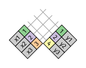
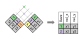
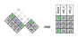

# Datos relacionales

## Introducción

Es raro que un análisis de datos involucre una única tabla de datos. Lo típico es que tengas muchas tablas que debes combinar para responder a tus preguntas de interés. De manera colectiva, se le llama _datos relacionales_ a esas múltiples tablas de datos, ya que sus relaciones, y no solo los conjuntos de datos individuales, son importantes.

Las relaciones siempre se definen sobre un par de tablas. Todas las otras relaciones se construyen sobre esta idea simple: las relaciones entre tres o más tablas son siempre una propiedad de las relaciones entre cada par. ¡A veces ambos elementos de un par pueden ser la misma tabla! Esto se necesita si, por ejemplo, tienes una tabla de personas y cada persona tiene una referencia a sus padres.

Para trabajar con datos relacionales necesitas verbos que funcionen con pares de tablas. Existen tres familias de verbos diseñadas para trabajar con datos relacionales:

* __Uniones de transformación__ (del inglés _mutating joins_), que agregan nuevas variables a un *data frame* a partir de las observaciones coincidentes en otra tabla.

* __Uniones de filtro__ (del inglés _filtering joins_), que filtran observaciones en un *data frame* con base en si coinciden o no con una observación de otra tabla.

* __Operaciones de conjuntos__ (del inglés _set operations_), que tratan las observaciones como elementos de un conjunto.

El lugar más común para encontrar datos relacionales es en un sistema _relacional_ de administración de bases de datos (*Relational Data Base Management System* en inglés), un concepto que abarca casi todas las bases de datos modernas. Si has usado una base de datos con anterioridad, casi seguramente fue SQL. Si es así, los conceptos de este capítulo debiesen ser familiares, aunque su expresión en **dplyr** es un poco distinta. En términos generales, **dplyr** es un poco más fácil de usar que SQLes, ya que dplyr se especializa en el análisis de datos: facilita las operaciones habituales, a expensas de dificultar otras que no se requieren a menudo para el análisis de datos.

### Prerrequisitos

Vamos a explorar datos relacionales contenidos en el paquete **datos** usando los verbos para dos tablas de **dplyr**.


```r
library(tidyverse)
library(datos)
```

## Datos sobre vuelos {#nycflights13-relational}

Usaremos datos sobre vuelos desde y hacia Nueva York para aprender sobre datos relacionales^[NdT. El texto original se refiere al paquete nycflights13 cuya traducción se incluye en el paquete **datos**.]. El paquete **datos** contiene cuatro tablas que se relacionan con la tabla `vuelos` que se usó en el capítulo sobre [transformación de datos]:

* `aerolineas` permite observar el nombre completo de la aerolínea a partir de su código abreviado:

 
 ```r
 aerolineas
 #> # A tibble: 16 x 2
 #>   aerolinea nombre                  
 #>   <chr>     <chr>                   
 #> 1 9E        Endeavor Air Inc.       
 #> 2 AA        American Airlines Inc.  
 #> 3 AS        Alaska Airlines Inc.    
 #> 4 B6        JetBlue Airways         
 #> 5 DL        Delta Air Lines Inc.    
 #> 6 EV        ExpressJet Airlines Inc.
 #> # … with 10 more rows
 ```

* `aeropuertos` entrega información de cada aeropuerto, identificado por su `código`:

 
 ```r
 aeropuertos
 #> # A tibble: 1,458 x 8
 #>   codigo_aeropuer… nombre latitud longitud altura zona_horaria horario_verano
 #>   <chr>            <chr>    <dbl>    <dbl>  <dbl>        <dbl> <chr>         
 #> 1 04G              Lansd…    41.1    -80.6   1044           -5 A             
 #> 2 06A              Moton…    32.5    -85.7    264           -6 A             
 #> 3 06C              Schau…    42.0    -88.1    801           -6 A             
 #> 4 06N              Randa…    41.4    -74.4    523           -5 A             
 #> 5 09J              Jekyl…    31.1    -81.4     11           -5 A             
 #> 6 0A9              Eliza…    36.4    -82.2   1593           -5 A             
 #> # … with 1,452 more rows, and 1 more variable: zona_horaria_iana <chr>
 ```

* `aviones` entrega información de cada avión, identificado por su `codigo_cola`:

 
 ```r
 aviones
 #> # A tibble: 3,322 x 9
 #>   codigo_cola  anio tipo  fabricante modelo motores asientos velocidad
 #>   <chr>       <int> <chr> <chr>      <chr>    <int>    <int>     <int>
 #> 1 N10156       2004 Ala … EMBRAER    EMB-1…       2       55        NA
 #> 2 N102UW       1998 Ala … AIRBUS IN… A320-…       2      182        NA
 #> 3 N103US       1999 Ala … AIRBUS IN… A320-…       2      182        NA
 #> 4 N104UW       1999 Ala … AIRBUS IN… A320-…       2      182        NA
 #> 5 N10575       2002 Ala … EMBRAER    EMB-1…       2       55        NA
 #> 6 N105UW       1999 Ala … AIRBUS IN… A320-…       2      182        NA
 #> # … with 3,316 more rows, and 1 more variable: tipo_motor <chr>
 ```

* `clima` entrega información del clima en cada aeropuerto de Nueva York para cada hora:

 
 ```r
 clima
 #> # A tibble: 26,115 x 15
 #>   origen  anio   mes   dia  hora temperatura punto_rocio humedad
 #>   <chr>  <int> <int> <int> <int>       <dbl>       <dbl>   <dbl>
 #> 1 EWR     2013     1     1     1        39.0        26.1    59.4
 #> 2 EWR     2013     1     1     2        39.0        27.0    61.6
 #> 3 EWR     2013     1     1     3        39.0        28.0    64.4
 #> 4 EWR     2013     1     1     4        39.9        28.0    62.2
 #> 5 EWR     2013     1     1     5        39.0        28.0    64.4
 #> 6 EWR     2013     1     1     6        37.9        28.0    67.2
 #> # … with 26,109 more rows, and 7 more variables: direccion_viento <dbl>,
 #> #   velocidad_viento <dbl>, velocidad_rafaga <dbl>, precipitacion <dbl>,
 #> #   presion <dbl>, visibilidad <dbl>, fecha_hora <dttm>
 ```

Una forma de mostrar las relaciones entre las diferentes tablas es mediante un diagrama:


Este diagrama es un poco abrumador, ¡pero es simple comparado con algunos que verás en el exterior! La clave para entender estos diagramas es recordar que cada relación siempre involucra un par de tablas. No necesitas entender todo el diagrama, necesitas entender la cadena de relaciones entre las tablas que te interesan.

En estos datos:

* `vuelos` se connecta con `aviones` a través de la variable `codigo_cola`.
 
* `vuelos` se conecta con `aerolineas` a través de la variable `codigo_carrier`.

* `vuelos` se conecta con `aeropuertos` de dos formas: a través de las variables `origen` y
 `destino`.

* `vuelos` se conecta con `clima` a través de las variables `origen` (la ubicación), 
 `anio`, `mes`, `dia` y `hora` (el horario).

### Ejercicios

1. Imagina que necesitas dibujar (aproximadamente) la ruta que cada avión vuela desde su origen
   hasta el destino. ¿Qué variables necesitarías? ¿Qué tablas necesitarías combinar?

1. Olvidamos dibujar la relación entre `clima` y `aeropuertos`. ¿Cuál es la relación y cómo debería
   aparecer en el diagrama?

1. `clima` únicamente contiene información de los aeropuertos de origen (Nueva York).
    Si incluyera registros para todos los aeropuertos de EEUU, ¿qué relación tendría con `vuelos`?

1. Sabemos que hay días "especiales" en el año y pocas personas suelen volar en ellos.
   ¿Cómo se representarían en un data frame? ¿Cuáles serían las claves primarias de esa tabla?
   ¿Cómo se conectaría con las tablas existentes?

## Claves

Las variables usadas para conectar cada par de variables se llaman _claves_ (del inglés _key_). Una clave es una variable (o un conjunto de variables) que identifican de manera única una observación. En casos simples, una sola variable es suficiente para identificar una observación. Por ejemplo, cada avión está identificado de forma única por su `codigo_cola`. En otros casos, se pueden necesitar múltiples variables. Por ejemplo, para identificar una observación en `clima` se necesitan cinco variables:  `anio`, `mes`, `dia`, `hora` y `origen`.

Existen dos tipos de claves:

* Una _clave primaria_ identifica únicamente una observación en su propia tabla.
  Por ejemplo, `aviones$codigo_cola` es una clave primaria, ya que identifica de
  manera única cada avión en la tabla `aviones`.

* Una _clave foránea_ únicamente identifica una observación en otra tabla.
  Por ejemplo, `vuelos$codigo_cola` es una clave foránea, ya que aparece en la
  tabla `vuelos`, en la que une cada vuelo con un único avión.

Una variable puede ser clave primaria _y_  clave foránea a la vez. Por ejemplo, `origen` es parte de la clave primaria `clima` y también una clave foránea de `aeropuertos`.

Una vez que identificas las claves primarias en tus tablas, es una buena práctica verificar que identifican de forma única cada observación. Una forma de hacerlo es usar `count()` con las claves primarias y buscar las entradas con `n` mayor a uno:


```r
aviones %>%
  count(codigo_cola) %>%
  filter(n > 1)
#> # A tibble: 0 x 2
#> # … with 2 variables: codigo_cola <chr>, n <int>

clima %>%
  count(anio, mes, dia, hora, origen) %>%
  filter(n > 1)
#> # A tibble: 3 x 6
#>    anio   mes   dia  hora origen     n
#>   <int> <int> <int> <int> <chr>  <int>
#> 1  2013    11     3     1 EWR        2
#> 2  2013    11     3     1 JFK        2
#> 3  2013    11     3     1 LGA        2
```

A veces una tabla puede no tener una clave primaria explícita: cada fila es una observación, pero no existe una combinación de variables que la identifique de forma confiable. Por ejemplo, ¿cuál es la clave primaria en la tabla `vuelos`? Quizás pienses que podría ser la fecha más el vuelo o el código de cola, pero ninguna de esas variables es única:


```r
vuelos %>%
  count(anio, mes, dia, vuelo) %>%
  filter(n > 1)
#> # A tibble: 29,768 x 5
#>    anio   mes   dia vuelo     n
#>   <int> <int> <int> <int> <int>
#> 1  2013     1     1     1     2
#> 2  2013     1     1     3     2
#> 3  2013     1     1     4     2
#> 4  2013     1     1    11     3
#> 5  2013     1     1    15     2
#> 6  2013     1     1    21     2
#> # … with 29,762 more rows

vuelos %>%
  count(anio, mes, dia, codigo_cola) %>%
  filter(n > 1)
#> # A tibble: 64,928 x 5
#>    anio   mes   dia codigo_cola     n
#>   <int> <int> <int> <chr>       <int>
#> 1  2013     1     1 N0EGMQ          2
#> 2  2013     1     1 N11189          2
#> 3  2013     1     1 N11536          2
#> 4  2013     1     1 N11544          3
#> 5  2013     1     1 N11551          2
#> 6  2013     1     1 N12540          2
#> # … with 64,922 more rows
```

Al comenzar a trabajar con estos datos, ingenuamente asumimos que cada número de vuelo sería usado solo una vez al día: eso haría mucho más simple comunicar problemas con un vuelo específico. ¡Desafortunadamente este no es el caso! Si una tabla no tiene una clave primaria, a veces es útil incluir una con `mutate()` y `row_number()` (_número de fila_). Eso simplifica hacer coincidir observaciones una vez que haz hecho algunos filtros y quieres volver a verificar con los datos originales. Esto se llama __clave subrogada__.

Una clave primaria y su correspondiente clave foránea en otra tabla forman una __relación__. Las relaciones son típicamente uno-a-muchos. Por ejemplo, cada vuelo tiene un avión, pero cada avión tiene muchos vuelos. En otros datos, ocasionalmente verás relaciones uno-a-uno. Puedes pensar esto como un caso especial de uno-a-muchos. Puedes modelar relaciones muchos-a-muchos como relaciones de la forma muchos-a-uno y uno-a-muchos. Por ejemplo, en estos datos existe una relación muchos-a-muchos entre aerolíneas y aeropuertos: cada aerolínea vuela a muchos aeropuertos, cada aeropuerto recibe a muchas aerolíneas.

### Ejercicios

1. Agrega una clave subrogada a `vuelos`.

1. Identifica las claves en los siguientes conjuntos de datos

  1. `datos::bateadores`
  1. `datos::nombres`
  1. `datos::atmosfera`
  1. `datos::vehiculos`
  1. `datos::diamantes`
  
 (Puede que necesites leer un poco de documentación.)

1. Dibuja un diagrama que ilustre las conexiones entre las tablas `bateadores`,
  `personas` y `salarios` incluidas en el paquete **datos**. Dibuja otro diagrama que muestre la
  relación entre `personas`, `dirigentes` y `premios_dirigentes`.

    ¿Cómo caracterizarías las relación entre `bateadores`, `lanzadores` y `jardineros`?

## Uniones de transformación {#mutating-joins}

La primera herramienta que miraremos para combinar pares de variables es la __unión de transformación__ (_mutating join_). Una unión de transformación te permite combinar variables a partir de dos tablas. Primero busca coincidencias de observaciones de acuerdo a sus claves y luego copia las variables de una tabla en la otra.

Tal como `mutate()`, las funciones de unión agregan variables hacia la derecha, por lo que si tienes muchas variables inicialmente, las nuevas variables no se imprimirán. Para estos ejemplos, crearemos un conjunto de datos más angosto para que sea más fácil ver qué es lo que está ocurriendo: 


```r
vuelos2 <- vuelos %>%
  select(anio:dia, hora, origen, destino, codigo_cola, aerolinea)
vuelos2
#> # A tibble: 336,776 x 8
#>    anio   mes   dia  hora origen destino codigo_cola aerolinea
#>   <int> <int> <int> <dbl> <chr>  <chr>   <chr>       <chr>    
#> 1  2013     1     1     5 EWR    IAH     N14228      UA       
#> 2  2013     1     1     5 LGA    IAH     N24211      UA       
#> 3  2013     1     1     5 JFK    MIA     N619AA      AA       
#> 4  2013     1     1     5 JFK    BQN     N804JB      B6       
#> 5  2013     1     1     6 LGA    ATL     N668DN      DL       
#> 6  2013     1     1     5 EWR    ORD     N39463      UA       
#> # … with 336,770 more rows
```

(Recuerda que en RStudio puedes también usar `View()` para evitar este problema.)

Imagina que quieres incluir el nombre completo de la aerolínea en `vuelos2`. Puedes combinar los datos de `aerolinas` y `vuelos2` con `left_join()` (*union_izquierda*):


```r
vuelos2 %>%
  select(-origen, -destino) %>%
  left_join(aerolineas, by = "aerolinea")
#> # A tibble: 336,776 x 7
#>    anio   mes   dia  hora codigo_cola aerolinea nombre                
#>   <int> <int> <int> <dbl> <chr>       <chr>     <chr>                 
#> 1  2013     1     1     5 N14228      UA        United Air Lines Inc. 
#> 2  2013     1     1     5 N24211      UA        United Air Lines Inc. 
#> 3  2013     1     1     5 N619AA      AA        American Airlines Inc.
#> 4  2013     1     1     5 N804JB      B6        JetBlue Airways       
#> 5  2013     1     1     6 N668DN      DL        Delta Air Lines Inc.  
#> 6  2013     1     1     5 N39463      UA        United Air Lines Inc. 
#> # … with 336,770 more rows
```

El resultado de unir `aerolineas` y `vuelos2` es la inclusión de una variable adicional: `nombre`. Esta es la razón de que llamemos unión de transformación a este tipo de unión. En este caso, podrías obtener el mismo resultado usando `mutate()` junto a las operaciones de filtro de R base:


```r
vuelos2 %>%
  select(-origen, -destino) %>%
  mutate(nombre = aerolineas$nombre[match(aerolinea, aerolineas$aerolinea)])
#> # A tibble: 336,776 x 7
#>    anio   mes   dia  hora codigo_cola aerolinea nombre                
#>   <int> <int> <int> <dbl> <chr>       <chr>     <chr>                 
#> 1  2013     1     1     5 N14228      UA        United Air Lines Inc. 
#> 2  2013     1     1     5 N24211      UA        United Air Lines Inc. 
#> 3  2013     1     1     5 N619AA      AA        American Airlines Inc.
#> 4  2013     1     1     5 N804JB      B6        JetBlue Airways       
#> 5  2013     1     1     6 N668DN      DL        Delta Air Lines Inc.  
#> 6  2013     1     1     5 N39463      UA        United Air Lines Inc. 
#> # … with 336,770 more rows
```

Sin embargo, esto último es difícil de generalizar cuando necesitas hacer coincidir múltiples variables y requiere hacer una lectura detenida para entender lo que se quiere hacer.

En las siguientes secciones explicaremos en detalle cómo funcionan las uniones de transformación. Comenzarás aprendiendo una representación visual útil de las uniones. Luego usaremos eso para explicar las cuatro uniones de transformación: la unión interior y las tres uniones exteriores. Cuando trabajas con datos reales, las claves no siempre identifican a las observaciones de forma única. Es por eso que a continuación hablaremos de lo que ocurre cuando no existe una coincidencia única. Finalmente, aprenderás cómo decirle a **dplyr** qué variables son las claves para una unión determinada.

### Entendiendo las uniones

Para ayudarte a entender las uniones, usaremos una representación gráfica:


```r
x <- tribble(
  ~key, ~val_x,
  1, "x1",
  2, "x2",
  3, "x3"
)
y <- tribble(
  ~key, ~val_y,
  1, "y1",
  2, "y2",
  4, "y3"
)
```

La columna coloreada representa la variable "clave": estas se usan para unir filas entre las tablas. La columa gris representa la columna "valor" que se usa en todo el proceso. En estos ejemplos te mostraremos una única clave, pero la idea es generalizable de manera directa a múltiples claves y múltiples valores.

Una unión es una forma de conectar cada fila en `x` con cero, una o más filas en `y`. El siguiente diagrama muestra cada coincidencia potencial como una intersección de pares de líneas.



(Si observas detenidamente, te darás cuenta de que hemos cambiado el orden de las columnas clave y valor en `x`. Esto es para enfatizar que las uniones encuentran coincidencias basadas en las claves; el valor simplemente se traslada durante el proceso.)

En la unión que mostramos, las coincidencias se indican con puntos. El número de puntos es igual al número de coincidencias y al número de filas en la salida.



### Unión interior {#inner-join}

La forma más simple de unión es la _unión interior_ (del inglés _inner join_). Una unión interior une pares de observaciones siempre que sus claves sean iguales:


(Para ser precisos, esto corresponde a una _unión de igualdad_ (o _equijoin_) interior, debido a que las claves se unen usando el operador de igualdad. Dado que muchas uniones son uniones de igualdad, por lo general omitimos esa especificación.)

El output de una unión interior es un nuevo data frame que contiene la clave, los valores de x y los valores de y. Usamos `by` (*según*) para indicar a dplyr qué variable es la clave:


```r
x %>%
  inner_join(y, by = "key")
#> # A tibble: 2 x 3
#>     key val_x val_y
#>   <dbl> <chr> <chr>
#> 1     1 x1    y1   
#> 2     2 x2    y2
```

La propiedad más importante de una unión interior es que las filas no coincidentes no se incluyen en el resultado. Esto significa que generalmente las uniones interiores no son apropiadas para su uso en el análisis de datos dado que es muy fácil perder observaciones.

### Uniones exteriores {#outer-join}

Una unión interior mantiene las observaciones que aparecen en ambas tablas.  Una __unión exterior__ mantiene las observaciones que aparecen en al menos una de las tablas. Existen tres tipos de uniones exteriores:

* Una __unión izquierda__ (_left join_) mantiene todas las observaciones en `x`.
* Una __unión derecha__ (_right join_) mantiene todas las observaciones en `y`.
* Una __unión completa__ (_full join_) mantiene todas las observaciones en `x` e `y`.

Estas uniones funcionan agregando una observación "virtual" adicional a cada tabla. Esta observación tiene una clave que siempre coincide (de no haber otras claves coincidentes) y un valor que se llena con `NA`.

Gráficamente corresponde a lo siguiente:


La unión que más frecuentemente se usa es la unión izquierda: úsala cuando necesites buscar datos adicionales en otra tabla, dado que preserva las observaciones originales incluso cuando no hay coincidencias. La unión izquierda debiera ser tu unión por defecto, a menos que tengas un motivo importante para preferir una de las otras.

Otra forma de ilustrar diferentes tipos de uniones es mediante un diagrama de Venn:


Sin embargo, esta no es una buena representación. Puede ayudar a recordar qué uniones preservan las observaciones en qué tabla pero esto tiene una limitante importante: un diagrama de Venn no puede mostrar qué ocurre con las claves que no identifican de manera única una observación.

### Claves duplicadas {#join-matches}

Hasta ahora todos los diagramas han asumido que las claves son únicas. Pero ese no siempre es así. Esta sección explica qué ocurre en esos casos. Existen dos posibilidades:

1. Una tabla tiene claves duplicadas. Esto es útil cuando quieres agregar información 
  adicional dado que típicamente existe una relación uno a muchos.

 
  
  Nota que hemos puesto la columna   clave en una posición ligeramente distinta en el output.
  Esto refleja que la clave es una clave primaria en `y` y una clave foránea en `x`.

 
 ```r
 x <- tribble(
  ~key, ~val_x,
  1, "x1",
  2, "x2",
  2, "x3",
  1, "x4"
 )
 y <- tribble(
  ~key, ~val_y,
  1, "y1",
  2, "y2"
 )
 left_join(x, y, by = "key")
 #> # A tibble: 4 x 3
 #>     key val_x val_y
 #>   <dbl> <chr> <chr>
 #> 1     1 x1    y1   
 #> 2     2 x2    y2   
 #> 3     2 x3    y2   
 #> 4     1 x4    y1
 ```

1. Ambas tablas tienen claves duplicadas. Esto es usualmente un error debido a que 
  en ninguna de las tablas las claves identifican de manera única una observación.
  Cuando unes claves duplicadas, se obtienen todas las posibles combinaciones, es decir, el producto cartesiano:

 

   
   ```r
     x <- tribble(
    ~key, ~val_x,
    1, "x1",
    2, "x2",
    2, "x3",
    3, "x4"
     )
     y <- tribble(
    ~key, ~val_y,
    1, "y1",
    2, "y2",
    2, "y3",
    3, "y4"
     )
     left_join(x, y, by = "key")
   #> # A tibble: 6 x 3
   #>     key val_x val_y
   #>   <dbl> <chr> <chr>
   #> 1     1 x1    y1   
   #> 2     2 x2    y2   
   #> 3     2 x2    y3   
   #> 4     2 x3    y2   
   #> 5     2 x3    y3   
   #> 6     3 x4    y4
   ```

### Definiendo las columnas clave {#join-by}

Hasta ahora, los pares de tablas siempre se han unido de acuerdo a una única variable y esa variable tiene el mismo nombre en ambas tablas. Esta restricción se expresa de la forma `by = "key"`. Puedes usar otros valores de `by` para conectar las tablas de otras maneras:

  * Por defecto, `by = NULL`, usa todas las variables que aparecen en ambas tablas, 
    lo que se conoce como unión __natural__. Por ejemplo, las tablas vuelos y clima 
    coinciden en sus variables comunes: `anio`, `mes`, `dia`, `hora` y `origen`.

 
 ```r
 vuelos2 %>%
  left_join(clima)
 #> Joining, by = c("anio", "mes", "dia", "hora", "origen")
 #> # A tibble: 336,776 x 18
 #>    anio   mes   dia  hora origen destino codigo_cola aerolinea temperatura
 #>   <int> <int> <int> <dbl> <chr>  <chr>   <chr>       <chr>           <dbl>
 #> 1  2013     1     1     5 EWR    IAH     N14228      UA               39.0
 #> 2  2013     1     1     5 LGA    IAH     N24211      UA               39.9
 #> 3  2013     1     1     5 JFK    MIA     N619AA      AA               39.0
 #> 4  2013     1     1     5 JFK    BQN     N804JB      B6               39.0
 #> 5  2013     1     1     6 LGA    ATL     N668DN      DL               39.9
 #> 6  2013     1     1     5 EWR    ORD     N39463      UA               39.0
 #> # … with 336,770 more rows, and 9 more variables: punto_rocio <dbl>,
 #> #   humedad <dbl>, direccion_viento <dbl>, velocidad_viento <dbl>,
 #> #   velocidad_rafaga <dbl>, precipitacion <dbl>, presion <dbl>,
 #> #   visibilidad <dbl>, fecha_hora <dttm>
 ```

  * Un vector de caracteres, `by = "x"`. Esto es similar a una unión natural, 
    pero usa algunas de las variables comunes. Por ejemplo, `vuelos` y `aviones` 
    tienen la variable `anio`, pero esta significa cosas distintas en cada tabla 
    por lo que queremos unir por `codigo_cola`.

 
 ```r
 vuelos2 %>%
  left_join(aviones, by = "codigo_cola")
 #> # A tibble: 336,776 x 16
 #>   anio.x   mes   dia  hora origen destino codigo_cola aerolinea anio.y tipo 
 #>    <int> <int> <int> <dbl> <chr>  <chr>   <chr>       <chr>      <int> <chr>
 #> 1   2013     1     1     5 EWR    IAH     N14228      UA          1999 Ala …
 #> 2   2013     1     1     5 LGA    IAH     N24211      UA          1998 Ala …
 #> 3   2013     1     1     5 JFK    MIA     N619AA      AA          1990 Ala …
 #> 4   2013     1     1     5 JFK    BQN     N804JB      B6          2012 Ala …
 #> 5   2013     1     1     6 LGA    ATL     N668DN      DL          1991 Ala …
 #> 6   2013     1     1     5 EWR    ORD     N39463      UA          2012 Ala …
 #> # … with 336,770 more rows, and 6 more variables: fabricante <chr>,
 #> #   modelo <chr>, motores <int>, asientos <int>, velocidad <int>,
 #> #   tipo_motor <chr>
 ```

  Nota que la variable `anio` (que aparece en los dos data frames de entrada, 
  pero que no es igual en ambos casos) se desambigua con un sufijo en el output.

  * Un vector de caracteres con nombres: `by = c("a" = "b")`. Esto va a unir la 
    variable `a` en la tabla `x` con la variabla `b` en la tabla `y`. Las variables de 
    `x` se usarán en el output.

  Por ejemplo, si queremos dibujar un mapa necesitamos combinar los datos de vuelos con los datos de aeropuertos, que contienen la ubicación de cada uno (`latitud` y `longitud`). Cada vuelo tiene un `aeropuerto` de origen y destino, por lo que necesitamos especficar cuál queremos unir:

 
 ```r
 vuelos2 %>%
  left_join(aeropuertos, c("origen" = "codigo_aeropuerto"))
 #> # A tibble: 336,776 x 15
 #>    anio   mes   dia  hora origen destino codigo_cola aerolinea nombre latitud
 #>   <int> <int> <int> <dbl> <chr>  <chr>   <chr>       <chr>     <chr>    <dbl>
 #> 1  2013     1     1     5 EWR    IAH     N14228      UA        Newar…    40.7
 #> 2  2013     1     1     5 LGA    IAH     N24211      UA        La Gu…    40.8
 #> 3  2013     1     1     5 JFK    MIA     N619AA      AA        John …    40.6
 #> 4  2013     1     1     5 JFK    BQN     N804JB      B6        John …    40.6
 #> 5  2013     1     1     6 LGA    ATL     N668DN      DL        La Gu…    40.8
 #> 6  2013     1     1     5 EWR    ORD     N39463      UA        Newar…    40.7
 #> # … with 336,770 more rows, and 5 more variables: longitud <dbl>, altura <dbl>,
 #> #   zona_horaria <dbl>, horario_verano <chr>, zona_horaria_iana <chr>
  
 vuelos2 %>%
  left_join(aeropuertos, c("destino" = "codigo_aeropuerto"))
 #> # A tibble: 336,776 x 15
 #>    anio   mes   dia  hora origen destino codigo_cola aerolinea nombre latitud
 #>   <int> <int> <int> <dbl> <chr>  <chr>   <chr>       <chr>     <chr>    <dbl>
 #> 1  2013     1     1     5 EWR    IAH     N14228      UA        Georg…    30.0
 #> 2  2013     1     1     5 LGA    IAH     N24211      UA        Georg…    30.0
 #> 3  2013     1     1     5 JFK    MIA     N619AA      AA        Miami…    25.8
 #> 4  2013     1     1     5 JFK    BQN     N804JB      B6        <NA>      NA  
 #> 5  2013     1     1     6 LGA    ATL     N668DN      DL        Harts…    33.6
 #> 6  2013     1     1     5 EWR    ORD     N39463      UA        Chica…    42.0
 #> # … with 336,770 more rows, and 5 more variables: longitud <dbl>, altura <dbl>,
 #> #   zona_horaria <dbl>, horario_verano <chr>, zona_horaria_iana <chr>
 ```

### Ejercicios

1. Calcula el atraso promedio por destino y luego une los datos en `aeropuertos` 
   para que puedas mostrar la distribución espacial de los atrasos. Esta es una forma fácil de dibujar un mapa de los Estados Unidos:
   
   
   ```r
   aeropuertos %>%
   semi_join(vuelos, c("codigo_aeropuerto" = "destino")) %>%
   ggplot(aes(longitud, latitud)) +
   borders("state") +
   geom_point() +
   coord_quickmap()
   ```

  (No te preocupes si no entiendes quá hace `semi_join()`; lo aprenderás a continuación.)
  
  Quizás quieras usar `size` o `colour` para editar los puntos y mostrar 
  el atraso promedio de cada aeropuerto.
  
2. Agrega la ubicación de origen _y_ destino (por ejemplo, `latitud` y `longitud`) 
   a `vuelos`.

3. ¿Existe una relación entre la antiguedad de un avión y sus atrasos?

4. ¿Qué condiciones climáticas hacen más probables los atrasos?

5. ¿Qué sucedió el día 13 de junio de 2013? Muestra el patrón espacial de los atrasos. Luego, usa un buscador para encontrar referencias cruzadas con el clima.

 

### Otras implementaciones

`base::merge()` puede realizar los cuatro tipos de uniones de transformación:

dplyr | merge
-------------------|-------------------------------------------
`inner_join(x, y)` | `merge(x, y)`
`left_join(x, y)` | `merge(x, y, all.x = TRUE)`
`right_join(x, y)` | `merge(x, y, all.y = TRUE)`,
`full_join(x, y)` | `merge(x, y, all.x = TRUE, all.y = TRUE)`

La ventaja de los verbos específicos de **dplyr** es que muestran de manera clara la intención del código: la diferencia entre las uniones es realmente importante pero se esconde en los argumentos de `merge()`. Las uniones de **dplyr** son considerablemente más rápidas y no generan problemas con el orden de las filas

SQL es una inspiración para las convenciones de **dplyr**, por lo que su traducción es directa:

dplyr | SQL
-----------------------------|-------------------------------------------
`inner_join(x, y, by = "z")` | `SELECT * FROM x INNER JOIN y USING (z)`
`left_join(x, y, by = "z")` | `SELECT * FROM x LEFT OUTER JOIN y USING (z)`
`right_join(x, y, by = "z")` | `SELECT * FROM x RIGHT OUTER JOIN y USING (z)`
`full_join(x, y, by = "z")` | `SELECT * FROM x FULL OUTER JOIN y USING (z)`

Nota que "INNER" y "OUTER" son opcionales, por lo que a menudo se omiten.

Unir distintas variables entre tablas, por ejemplo `inner_join(x, y, by = c("a" = "b"))`, usa una sintaxis ligeramente distinta en SQL: `SELECT * FROM x INNER JOIN y ON x.a = y.b`. Como la sintaxis sugiere, SQL soporta un rango más amplio de tipos de uniones que **dplyr**, ya que puedes conectar tablas usando restricciones distintas a las de igualdad (a veces llamadas de no-igualdad).

## Uniones de filtro {#filtering-joins}

Las uniones de filtro unen observaciones de la misma forma que las uniones de transformación pero afectan a las observaciones, no a las variables. Existen dos tipos:

* `semi_join(x, y)` __mantiene__ todas las observaciones en `x` con coincidencias en `y`.
* `anti_join(x, y)` __descarta__ todas las observaciones en `x` con coincidencias en `y`.

Las semi uniones son útiles para unir tablas resumen previamente filtradas con las filas originales. Por ejemplo, imagina que encontraste los diez destinos más populares:


```r
destinos_populares <- vuelos %>%
  count(destino, sort = TRUE) %>%
  head(10)
destinos_populares
#> # A tibble: 10 x 2
#>   destino     n
#>   <chr>   <int>
#> 1 ORD     17283
#> 2 ATL     17215
#> 3 LAX     16174
#> 4 BOS     15508
#> 5 MCO     14082
#> 6 CLT     14064
#> # … with 4 more rows
```

Ahora quieres encontrar cada vuelo que fue a alguno de esos destinos. Puedes construir un filtro:


```r
vuelos %>%
  filter(destino %in% destinos_populares$destino)
#> # A tibble: 141,145 x 19
#>    anio   mes   dia horario_salida salida_programa… atraso_salida
#>   <int> <int> <int>          <int>            <int>         <dbl>
#> 1  2013     1     1            542              540             2
#> 2  2013     1     1            554              600            -6
#> 3  2013     1     1            554              558            -4
#> 4  2013     1     1            555              600            -5
#> 5  2013     1     1            557              600            -3
#> 6  2013     1     1            558              600            -2
#> # … with 141,139 more rows, and 13 more variables: horario_llegada <int>,
#> #   llegada_programada <int>, atraso_llegada <dbl>, aerolinea <chr>,
#> #   vuelo <int>, codigo_cola <chr>, origen <chr>, destino <chr>,
#> #   tiempo_vuelo <dbl>, distancia <dbl>, hora <dbl>, minuto <dbl>,
#> #   fecha_hora <dttm>
```

Pero es difícil extender este enfoque a varias variables. Por ejemplo, imagina que encontraste los diez días con los atrasos promedio más altos. ¿Cómo construirías un filtro que use `anio`, `mes` y `dia` para buscar coincidencias con `vuelos`? 

Puedes, en cambio, usar `semi_join()`, que conecta dos tablas de manera similar a una unión de transformación, pero en lugar de agregar nuevas columnas, mantiene las filas en `x` que tienen coincidencias en `y`:


```r
vuelos %>%
  semi_join(destinos_populares)
#> Joining, by = "destino"
#> # A tibble: 141,145 x 19
#>    anio   mes   dia horario_salida salida_programa… atraso_salida
#>   <int> <int> <int>          <int>            <int>         <dbl>
#> 1  2013     1     1            542              540             2
#> 2  2013     1     1            554              600            -6
#> 3  2013     1     1            554              558            -4
#> 4  2013     1     1            555              600            -5
#> 5  2013     1     1            557              600            -3
#> 6  2013     1     1            558              600            -2
#> # … with 141,139 more rows, and 13 more variables: horario_llegada <int>,
#> #   llegada_programada <int>, atraso_llegada <dbl>, aerolinea <chr>,
#> #   vuelo <int>, codigo_cola <chr>, origen <chr>, destino <chr>,
#> #   tiempo_vuelo <dbl>, distancia <dbl>, hora <dbl>, minuto <dbl>,
#> #   fecha_hora <dttm>
```

Gráficamente, un `semi_join()` se ve de la siguiente forma:


Solo la existencia de coincidencias es importante; da igual qué observaciones son coincidentes. Esto significa que las uniones de filtro nunca duplican filas como lo hacen las uniones de transformación:


La operación inversa de `semi_join()` es `anti_join()`. `anti_join()` mantiene las filas que _no_ tienen coincidencias:


Las anti uniones son útiles para encontrar desajustes. Por ejemplo, al conectar `aviones` y `vuelos`, podría interesarte saber que existen muchos `vuelos` que no tienen coincidencias en `aviones`:


```r
vuelos %>%
  anti_join(aviones, by = "codigo_cola") %>%
  count(codigo_cola, sort = TRUE)
#> # A tibble: 722 x 2
#>   codigo_cola     n
#>   <chr>       <int>
#> 1 <NA>         2512
#> 2 N725MQ        575
#> 3 N722MQ        513
#> 4 N723MQ        507
#> 5 N713MQ        483
#> 6 N735MQ        396
#> # … with 716 more rows
```

### Ejercicios

1. ¿Qué significa que a un vuelo le falte `codigo_cola`? ¿Qué tienen en común los códigos 
   de cola que no tienen registros coincidentes en `aviones`? (Pista: una variable explica 
   ~90% de los problemas.)

1. Filtra los vuelos para mostrar únicamente los aviones que han realizado al menos cien
   viajes.

1. Combina `datos::vehiculos` y `datos::comunes` para encontrar los registros de los 
   modelos más comunes.

1. Encuentra las 48 horas (en el transcurso del año) que tengan los peores atrasos. Haz 
   una referencia cruzada con la tabla `clima`. ¿Puedes observar patrones?

1. ¿Qué te indica `anti_join(vuelos, aeropuertos, by = c("destino" = "codigo_aeropuerto"))`?
   ¿Qué te indica `anti_join(aeropuertos, vuelos, by = c("codigo_aeropuerto" = "destino"))`?

1. Puedes esperar que exista una relación implícita entre aviones y aerolíneas, dado que cada 
   avión es operado por una única aerolínea. Confirma o descarta esta hipótesis usando las 
   herramientas que aprendiste más arriba.

## Problemas con las uniones

Los datos con los que has estado trabajando en este capítulo han sido limpiados de modo que tengas la menor cantidad de problemas posibles. Tus datos difícilmente estarán tan ordenados, por lo que hay algunas consideraciones y pasos a tener en cuenta para que las uniones funcionen adecuadamente sobre tus propios datos.

1. Comienza identificando las variables que forman las claves primarias en cada tabla.
   Usualmente debieras hacerlo considerando tus conocimientos de los datos, no observando 
   empíricamente las combinaciones de variables que resultan en un identificador único. 
   Si te centras en las variables sin pensar en sus significados, puedes tener la (mala) 
   suerte de encontrar una combinación única en tus datos pero que no sea válida en general.

   Por ejemplo, la altura y la longitud identifican de manera única cada aeropuerto, ¡pero 
   no son buenos identificadores!

   
   ```r
     aeropuertos %>% count(altura, longitud) %>% filter(n > 1)
   #> # A tibble: 0 x 3
   #> # … with 3 variables: altura <dbl>, longitud <dbl>, n <int>
   ```

1. Verifica que ninguna de las variables en la clave primaria esté perdida. 
   ¡Si hay un valor faltante no podrá identificar una observación!

1. Verifica que las claves foráneas coincidan con las claves primarias en 
   otra tabla. La mejor forma de hacerlo es mediante un `anti_join()`. Es común 
   que las claves no coincidan debido a errores en la entrada de datos. Arreglar 
   este problema requiere mucho trabajo.

   Si tienes claves perdidas, debes tener cuidado en el uso de unión interior 
   versus unión exterior y considerar cuidadosamente si quieres descartar las filas 
   que no tengan coincidencias.
   
Ten en cuenta que verificar el número de filas antes y después de unir no es suficiente para asegurar 
   que la unión funcionó de forma exitosa. Si tienes una unión interior con claves duplicadas en ambas tablas, 
   puedes tener la mala suerte de que el número de filas descartadas sea igual al número de filas duplicadas.

## Operaciones de conjuntos {#set-operations}

El tipo final de verbo para dos tablas son las operaciones de conjunto. Si bien lo usamos de manera poco frecuente, en ocasiones es útil cuando quieres dividir un filtro complejo en partes maś simples. Todas estas operaciones funcionan con una fila completa, comparando los valores de cada variable. Esto espera que los input `x` e `y` tengan las mismas variables y trata las observaciones como conjuntos: 

* `intersect(x, y)`: devuelve las observaciones comunes en `x` e `y`.
* `union(x, y)`: devuelve las observaciones únicas en `x` e `y`.
* `setdiff(x, y)`: devuelve las observaciones en `x` pero no en `y`.

Dados los siguientes datos simples:


```r
df1 <- tribble(
  ~x, ~y,
  1, 1,
  2, 1
)
df2 <- tribble(
  ~x, ~y,
  1, 1,
  1, 2
)
```

Las cuatro posibilidades son:


```r
intersect(df1, df2)
#> # A tibble: 1 x 2
#>       x     y
#>   <dbl> <dbl>
#> 1     1     1

# Nota que obtenemos 3 filas, no 4
union(df1, df2)
#> # A tibble: 3 x 2
#>       x     y
#>   <dbl> <dbl>
#> 1     1     1
#> 2     2     1
#> 3     1     2

setdiff(df1, df2)
#> # A tibble: 1 x 2
#>       x     y
#>   <dbl> <dbl>
#> 1     2     1

setdiff(df2, df1)
#> # A tibble: 1 x 2
#>       x     y
#>   <dbl> <dbl>
#> 1     1     2
```
