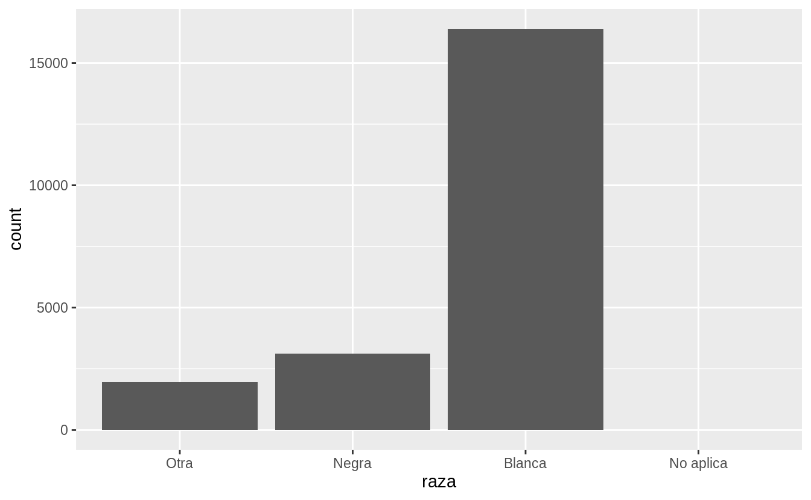
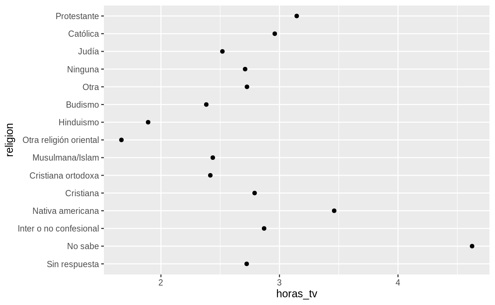
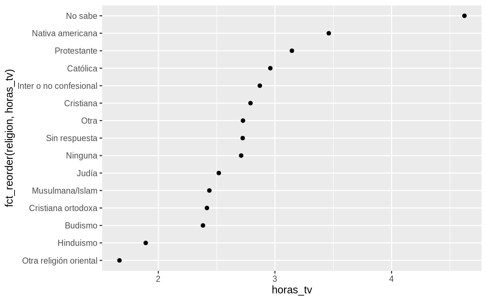
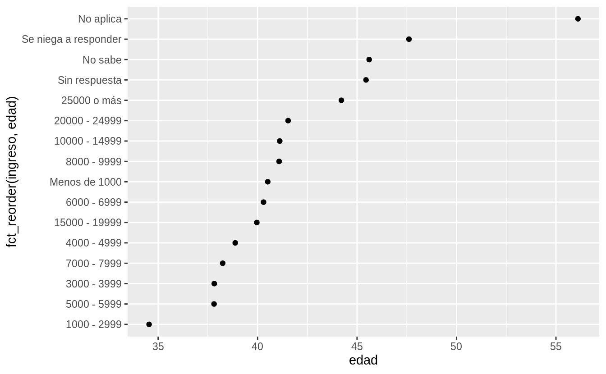
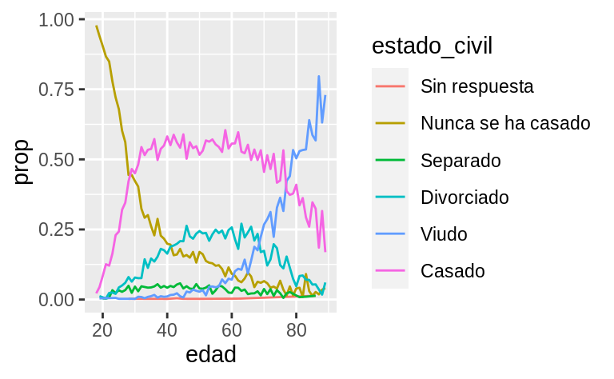
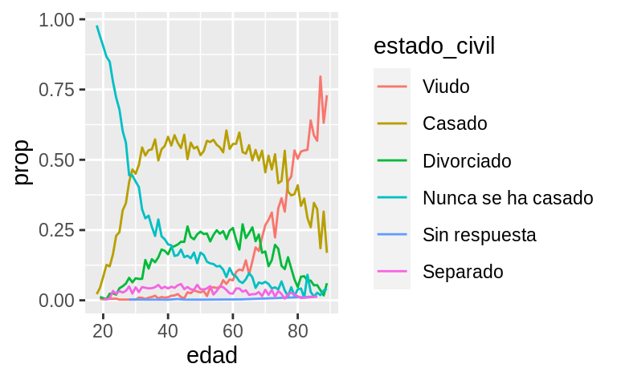
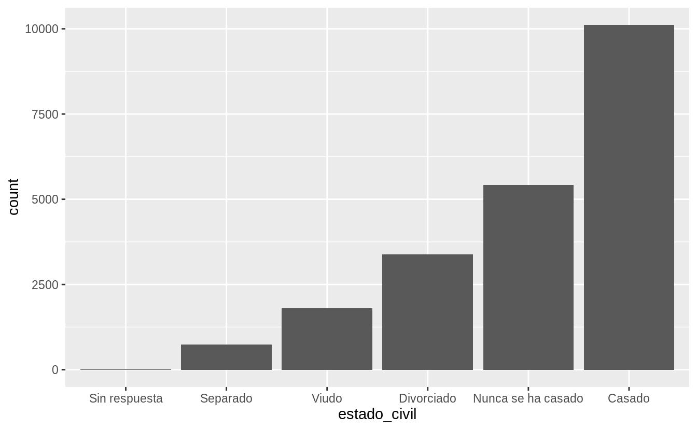

# Factores

## Introducción

En R, los factores se usan para trabajar con variables categóricas, es decir, variables que tienen un conjunto fijo y conocido de valores posibles. También son útiles cuando quieres mostrar vectores de caracteres en un orden no alfabético.

Históricamente, los factores eran más sencillos de trabajar que los caracteres. Como resultado, muchas de las funciones de R base automáticamente convierten los caracteres a factores. Esto significa que, a menudo, los factores aparecen en lugares donde no son realmente útiles. Afortunadamente, no tienes que preocuparte de eso en el tidyverse y puedes concentrarte en situaciones en las que los factores son genuinamente útiles.


### Prerrequisitos

Para trabajar con factores, vamos a usar el paquete __forcats__, que es parte del __tidyverse__. Este paquete provee herramientas para lidiar con variables **cat**egóricas (¡y es un anagrama de _factores_ en inglés!) y ofrece un amplio rango de ayudas para trabajar con factores. 


```r
library(tidyverse)
library(datos)
```

### Aprendiendo más

Si quieres aprender más sobre factores, te recomendamos leer el artículo de Amelia McNamara y Nicholas Horton, [_Wrangling categorical data in R_](https://peerj.com/preprints/3163/) (el nombre significa _Domando/Manejando Datos Categóricos en R_). Este artículo cuenta parte de la historia discutida en [_stringsAsFactors: An unauthorized biography_](http://simplystatistics.org/2015/07/24/stringsasfactors-an-unauthorized-biography/) (del inglés _cadenasComoFactores: Una Biografía No Autorizada_) y [_stringsAsFactors = \<sigh\>_](http://notstatschat.tumblr.com/post/124987394001/stringsasfactors-sigh) (del inglés _cadenasComoFactores = \<suspiro\>_), y compara las propuestas _tidy_ para los datos categóricos demostrados en este libro, en comparación a los métodos de R base. Una versión temprana de este artículo ayudó a motivar y definir el alcance del paquete __forcats__. ¡Gracias Amelia y Nick!


## Creando factores

Imagina que tienes una variable que registra meses:


```r
x1 <- c("Dic", "Abr", "Ene", "Mar")
```

Usar una cadena de caracteres (o _string_, en inglés) para guardar esta variable tiene dos problemas:

1. Solo hay doce meses posibles y no hay nada que te resguarde de errores de tipeo:


```r
x2 <- c("Dic", "Abr", "Eme", "Mar")
```

2. No se ordena de una forma útil:


```r
sort(x1)
#> [1] "Abr" "Dic" "Ene" "Mar"
```

Puedes solucionar ambos problemas con un factor. Para crearlo, debes empezar definiendo una lista con los __niveles__ válidos:


```r
niveles_meses <- c(
  "Ene", "Feb", "Mar", "Abr", "May", "Jun",
  "Jul", "Ago", "Sep", "Oct", "Nov", "Dic"
)
```

Ahora puedes crear un factor:


```r
y1 <- factor(x1, levels = niveles_meses)
y1
#> [1] Dic Abr Ene Mar
#> Levels: Ene Feb Mar Abr May Jun Jul Ago Sep Oct Nov Dic
sort(y1)
#> [1] Ene Mar Abr Dic
#> Levels: Ene Feb Mar Abr May Jun Jul Ago Sep Oct Nov Dic
```

Cualquier valor no fijado en el conjunto será convertido a `NA` de forma silenciosa:


```r
y2 <- factor(x2, levels = niveles_meses)
y2
#> [1] Dic  Abr  <NA> Mar 
#> Levels: Ene Feb Mar Abr May Jun Jul Ago Sep Oct Nov Dic
```

Si quieres una advertencia, puedes usar `readr::parse_factor()` (_segmentar un factor_, en inglés):


```r
y2 <- parse_factor(x2, levels = niveles_meses)
#> Warning: 1 parsing failure.
#> row col           expected actual
#>   3  -- value in level set    Eme
```

Si omites los niveles, se van a definir a partir de los datos en orden alfabético:


```r
factor(x1)
#> [1] Dic Abr Ene Mar
#> Levels: Abr Dic Ene Mar
```

A veces es preferible que el orden de los niveles se corresponda con su primera aparición en los datos. Puedes hacer esto cuando creas el factor, al definir los niveles con `unique(x)` _único_) o después con `fct_inorder()` (_factores en orden_):


```r
f1 <- factor(x1, levels = unique(x1))
f1
#> [1] Dic Abr Ene Mar
#> Levels: Dic Abr Ene Mar

f2 <- x1 %>% factor() %>% fct_inorder()
f2
#> [1] Dic Abr Ene Mar
#> Levels: Dic Abr Ene Mar
```

Si alguna vez necesitas acceso directo al conjunto de niveles válidos, puedes hacerlo con `levels()` (_niveles_):


```r
levels(f2)
#> [1] "Dic" "Abr" "Ene" "Mar"
```

## Encuesta Social General

Por el resto del capítulo, nos vamos a concentrar en `datos::encuesta`. Esta es la versión traducida al español de un conjunto de datos de ejemplo de la [General Social Survey](http://gss.norc.org), una encuesta realizada en Estados Unidos desde hace mucho tiempo, conducida por la organización de investigación independiente llamada NORC, en la Universidad de Chicago. La encuesta tiene miles de preguntas, así que en el conjunto de datos hemos seleccionado aquellas que ilustran algunos de los desafíos comunes que encontrarás al trabajar con factores.


```r
encuesta
#> # A tibble: 21,483 x 9
#>    anio estado_civil   edad raza  ingreso partido religion denominacion horas_tv
#>   <int> <fct>         <int> <fct> <fct>   <fct>   <fct>    <fct>           <int>
#> 1  2000 Nunca se ha …    26 Blan… 8000 -… Ind, p… Protest… Bautistas d…       12
#> 2  2000 Divorciado       48 Blan… 8000 -… No fue… Protest… Bautista, n…       NA
#> 3  2000 Viudo            67 Blan… No apl… Indepe… Protest… No denomina…        2
#> 4  2000 Nunca se ha …    39 Blan… No apl… Ind, p… Cristia… No aplica           4
#> 5  2000 Divorciado       25 Blan… No apl… No fue… Ninguna  No aplica           1
#> 6  2000 Casado           25 Blan… 20000 … Fuerte… Protest… Bautistas d…       NA
#> # … with 21,477 more rows
```

(Recuerda que como este conjunto de datos está provisto por un paquete, puedes obtener más información de las variables con `?encuesta`.)

Cuando los factores están almacenados en un _tibble_ no puedes ver sus niveles tan fácilmente. Una forma de verlos es con `count()` (_contar_):


```r
encuesta %>%
  count(raza)
#> # A tibble: 3 x 2
#>   raza       n
#>   <fct>  <int>
#> 1 Otra    1959
#> 2 Negra   3129
#> 3 Blanca 16395
```

O con un gráfico de barras:


```r
ggplot(encuesta, aes(raza)) +
  geom_bar()
```


Por defecto, __ggplot2__ retira los niveles que no tienen valores. Puedes forzarlos para que se visualicen con:


```r
ggplot(encuesta, aes(raza)) +
  geom_bar() +
  scale_x_discrete(drop = FALSE)
```



Estos niveles representan valores válidos que simplemente no ocurren en este conjunto de datos. Desafortunadamente, __dplyr__ no tiene una opción de `drop` (_descartar_, _eliminar_), pero la tendrá en el futuro.

Cuando se trabaja con factores, las dos operaciones más comunes son cambiar el orden de los niveles y cambiar sus valores. Estas operaciones se describen en las siguientes secciones.

### Ejercicios

1. Explora la distribución de `ingreso`. ¿Qué hace que el gráfico de barras por defecto sea tan difícil de comprender? ¿Cómo podrías mejorarlo?

1. ¿Cuál es la `religion` más común en esta encuesta? ¿Cuál es el `partido` más común?

1. ¿A qué `religion` se aplica cada `denominacion`? ¿Cómo puedes descubrirlo con una tabla? ¿Cómo lo puedes descubrir con una visualización?

## Modificar el orden de los factores

A menudo resulta útil cambiar el orden de los niveles de factores en una visualización. Por ejemplo, imagina que quieres explorar el número promedio de horas consumidas mirando televisión por día, para cada religión:


```r
resumen_religion <- encuesta %>%
  group_by(religion) %>%
  summarise(
    edad = mean(edad, na.rm = TRUE),
    horas_tv = mean(horas_tv, na.rm = TRUE),
    n = n()
  )
#> `summarise()` ungrouping output (override with `.groups` argument)

ggplot(resumen_religion, aes(horas_tv, religion)) + geom_point()
```



Este gráfico resulta dificil de interpretar porque no hay un patrón general. Podemos mejorarlo al ordenar los niveles de `religion` usando `fct_reorder()` ( _reordenar factores_). `fct_reorder()` requiere tres argumentos:

* `f`, el factor cuyos niveles quieres modificar.
* `x`, un vector numérico que quieres usar para reordenar los niveles.
* Opcionalmente, `fun`, una función que se usa si hay múltiples valores de `x` para cada valor de `f`. El valor por defecto es `median` (_mediana_).


```r
ggplot(resumen_religion, aes(horas_tv, fct_reorder(religion, horas_tv))) +
  geom_point()
```



Reordenar la columna religión (`religion`) hace que sea más sencillo ver que las personas en la categoría "No sabe" ven más televisión, mientras que "Hinduismo" y "Otra religión oriental" ven mucho menos.

Cuando haces transformaciones más complicadas, recomendamos que las remuevas de `aes()` hacia un paso de transformación separado usando `mutate()`. Por ejemplo, puedes reescribir el gráfico anterior de la siguiente forma:


```r
resumen_religion %>%
  mutate(religion = fct_reorder(religion, horas_tv)) %>%
  ggplot(aes(horas_tv, religion)) +
  geom_point()
```

¿Qué sucede si creamos un gráfico para observar cómo varía la edad promedio para cada ingreso reportado?


```r
resumen_ingreso <- encuesta %>%
  group_by(ingreso) %>%
  summarise(
    edad = mean(edad, na.rm = TRUE),
    horas_tv = mean(horas_tv, na.rm = TRUE),
    n = n()
  )
#> `summarise()` ungrouping output (override with `.groups` argument)

ggplot(resumen_ingreso, aes(edad, fct_reorder(ingreso, edad))) + geom_point()
```



En ete caso, ¡reordenar los niveles arbitrariamente no es una buena idea! Eso es porque `ingreso` ya tiene un orden basado en un principio determinado, con el cual no deberíamos meternos. Reserva `fct_reorder()` para factores cuyos niveles están ordenados arbitrariamente.

Sin embargo, sí tiene sentido mover "No Aplica" al frente, junto a los otros niveles especiales. Puedes usar `fct_relevel()` (_cambiar niveles_). Esta función recibe como argumento un factor, `f` y luego cualquier número de niveles que quieras mover al principio de la línea.


```r
ggplot(resumen_ingreso, aes(edad, fct_relevel(ingreso, "No aplica"))) +
  geom_point()
```


¿Por qué crees que la edad promedio para "No aplica" es tan alta?

Es otro el tipo de reordenamiento que resulta útil cuando estás coloreando las líneas de un gráfico. `fct_reorder2()` reordena el factor mediante los valores `y` asociados con los valores `x` más grandes. Esto hace que el gráfico sea más sencillo de leer, porque los colores de líneas se ajustan con la leyenda.


```r
por_edad <- encuesta %>%
  filter(!is.na(edad)) %>%
  count(edad, estado_civil) %>%
  group_by(edad) %>%
  mutate(prop = n / sum(n))

ggplot(por_edad, aes(edad, prop, colour = estado_civil)) +
  geom_line(na.rm = TRUE)

ggplot(por_edad, aes(edad, prop, colour = fct_reorder2(estado_civil, edad, prop))) +
  geom_line() +
  labs(colour = "estado_civil")
```



Finalmente, para los gráficos de barra puedes usar `fct_infreq()` (_frecuencia incremental de factores_) para ordenar los niveles incrementalmente según su frecuencia: este es el ordenamiento más sencillo porque no requiere de variables adicionales. Puedes querer combinarlo con `fct_rev()` (_invertir factores_).


```r
encuesta %>%
  mutate(estado_civil = estado_civil %>% fct_infreq() %>% fct_rev()) %>%
  ggplot(aes(estado_civil)) +
  geom_bar()
```



### Ejercicios

1. Hay algunos números sospechosamente grandes en `horas_tv`. ¿Es la media un buen resumen?

1. Identifica para cada factor en `encuesta` si el orden de los niveles es arbitrario o responde a algún principio.

1. ¿Por qué mover "No aplica" al inicio de los niveles lo llevó al final del gráfico?

## Modificar los niveles de los factores

Más poderoso que cambiar el orden de los niveles es cambiar sus valores. Esto te permite clarificar etiquetas para publicación y colapsar niveles para visualizaciones de alto nivel. La herramienta más general y más poderosa es `fct_recode()` (_recodificar factores_). Esta función te permite recodificar o cambiar el valor de cada nivel. Por ejemplo, toma la columna `encuesta$partido`:


```r
encuesta %>% count(partido)
#> # A tibble: 10 x 2
#>   partido                        n
#>   <fct>                      <int>
#> 1 Sin respuesta                154
#> 2 No sabe                        1
#> 3 Otro partido                 393
#> 4 Fuertemente republicano     2314
#> 5 No fuertemente republicano  3032
#> 6 Ind, pro rep                1791
#> # … with 4 more rows
```
Los niveles son concisos e inconsistentes. Modifiquémoslos un poco para que sean más largos y para poder usar una construcción paralela.


```r
encuesta %>%
  mutate(partido = fct_recode(partido,
    "Republicano duro" = "Fuertemente republicano",
    "Republicano moderado" = "No fuertemente republicano",
    "Independiente pro republicano" = "Ind, pro rep",
    "Independiente pro demócrata" = "Ind, pro dem",
    "Demócrata moderado" = "No fuertemente demócrata",
    "Demócrata duro" = "Fuertemente demócrata"
  )) %>%
  count(partido)
#> # A tibble: 10 x 2
#>   partido                           n
#>   <fct>                         <int>
#> 1 Sin respuesta                   154
#> 2 No sabe                           1
#> 3 Otro partido                    393
#> 4 Republicano duro               2314
#> 5 Republicano moderado           3032
#> 6 Independiente pro republicano  1791
#> # … with 4 more rows
```

`fct_recode()` no modificará los niveles que no han sido mencionados explícitamente y te advertirá si accidentalmente te refieres a un nivel que no existe.

Para combinar grupos, puedes asignar múltiples niveles viejos al mismo nivel nuevo:


```r
encuesta %>%
  mutate(partido = fct_recode(partido,
    "Republicano duro" = "Fuertemente republicano",
    "Republicano moderado" = "No fuertemente republicano",
    "Independiente pro republicano" = "Ind, pro rep",
    "Independiente pro demócrata" = "Ind, pro dem",
    "Demócrata moderado" = "No fuertemente demócrata",
    "Demócrata duro" = "Fuertemente demócrata",
    "Otro" = "Sin respuesta",
    "Otro" = "No sabe",
    "Otro" = "Otro partido"
  )) %>%
  count(partido)
#> # A tibble: 8 x 2
#>   partido                           n
#>   <fct>                         <int>
#> 1 Otro                            548
#> 2 Republicano duro               2314
#> 3 Republicano moderado           3032
#> 4 Independiente pro republicano  1791
#> 5 Independiente                  4119
#> 6 Independiente pro demócrata    2499
#> # … with 2 more rows
```

Debes usar esta técnica con cuidado: si agrupas categorías que son realmente diferentes, obtendrás resultados confusos y/o engañosos.

Si quieres colapsar muchos niveles, `fct_collapse()` (_colapsar factores_) es una variante muy útil de `fct_recode()`. Para cada nueva variable puedes proveer un vector de niveles viejos:


```r
encuesta %>%
  mutate(partido = fct_collapse(partido,
    otro = c("Sin respuesta", "No sabe", "Otro partido"),
    republicano = c("Fuertemente republicano", "No fuertemente republicano"),
    independiente = c("Ind, pro rep", "Independiente", "Ind, pro dem"),
    demócrata = c("No fuertemente demócrata", "Fuertemente demócrata")
  )) %>%
  count(partido)
#> # A tibble: 4 x 2
#>   partido           n
#>   <fct>         <int>
#> 1 otro            548
#> 2 republicano    5346
#> 3 independiente  8409
#> 4 demócrata      7180
```

A veces, simplemente quieres agrupar todos los grupos pequeños para simplificar un gráfico o tabla. Ese es un trabajo para `fct_lump()` (_agrupar factores_):


```r
encuesta %>%
  mutate(religion = fct_lump(religion, other_level = "Otra")) %>%
  count(religion)
#> # A tibble: 2 x 2
#>   religion        n
#>   <fct>       <int>
#> 1 Protestante 10846
#> 2 Otra        10637
```

El comportamiento por defecto es agrupar los grupos pequeños de forma progresiva, asegurando que la agregación continúa siendo el grupo más pequeño. En este caso, esto no resulta demasiado útil: es cierto que la mayoría de los estadounidenses en esta encuesta son protestantes, pero probablemente hemos colapsado en exceso.

En cambio, podemos usar el parámetro `n` para especificar cuántos grupos (excluyendo _otros_) queremos colapsar:


```r
encuesta %>%
  mutate(religion = fct_lump(religion, n = 10, other_level = "Otra")) %>%
  count(religion, sort = TRUE) %>%
  print(n = Inf)
#> # A tibble: 10 x 2
#>    religion                   n
#>    <fct>                  <int>
#>  1 Protestante            10846
#>  2 Católica                5124
#>  3 Ninguna                 3523
#>  4 Cristiana                689
#>  5 Otra                     458
#>  6 Judía                    388
#>  7 Budismo                  147
#>  8 Inter o no confesional   109
#>  9 Musulmana/Islam          104
#> 10 Cristiana ortodoxa        95
```

### Ejercicios

1. ¿Cómo han cambiado en el tiempo las proporciones de personas que se identifican como demócratas, republicanas e independientes?

1. ¿Cómo podrías colapsar `ingreso` en un grupo más pequeño de categorías?
