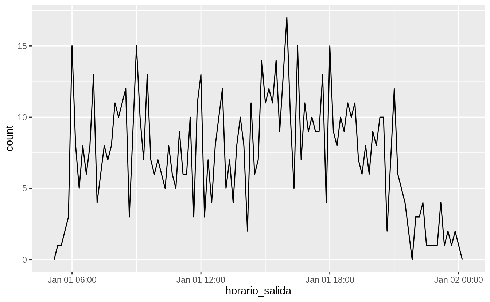
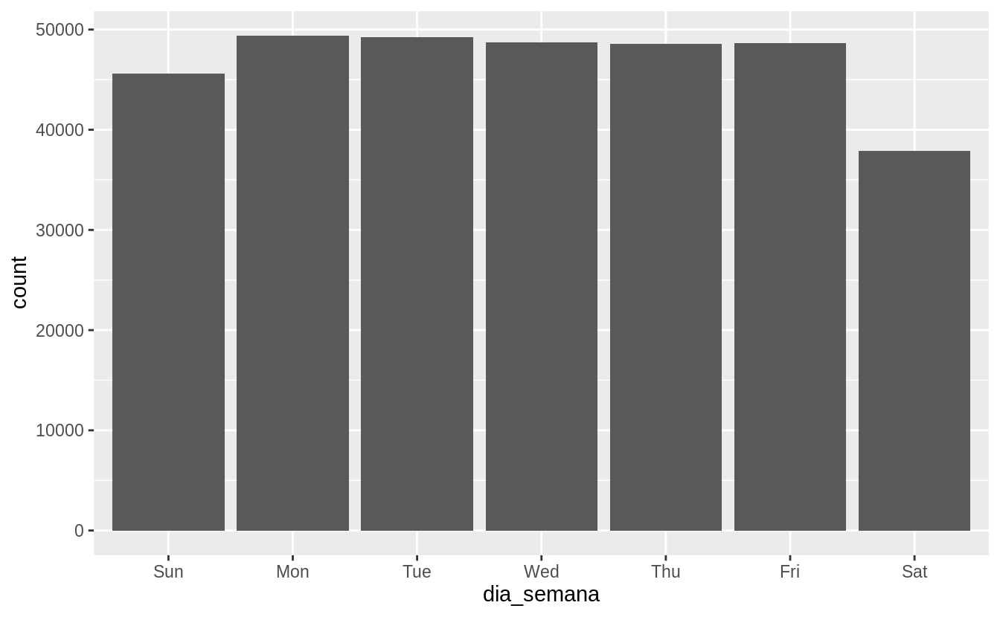
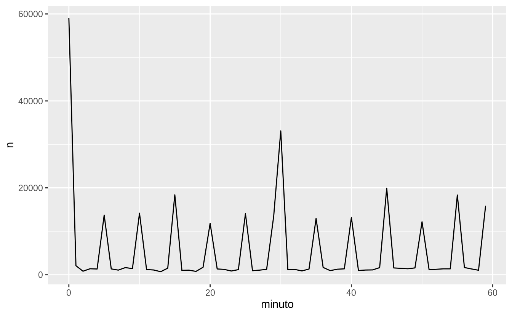
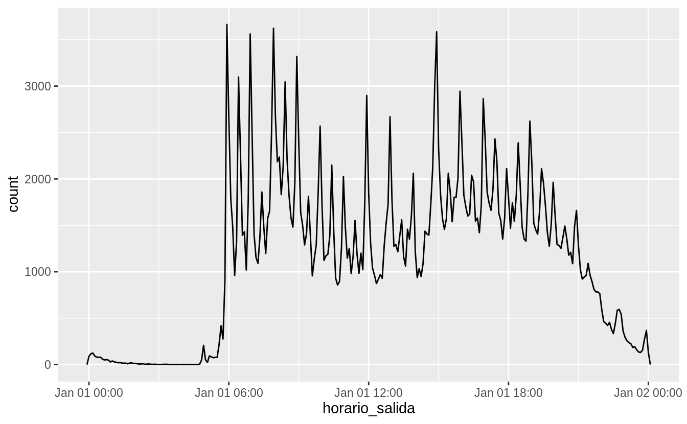

# Fechas y horas

## Introducción

Este capítulo te mostrará cómo trabajar con fechas y horas en R. A primera vista, esto parece sencillo. Las usas en todo momento en tu vida regular y no parecen causar demasiada confusión. Sin embargo, cuanto más aprendes de fechas y horas, más complicadas se vuelven. Para prepararnos, intenta estas preguntas sencillas:

* ¿Todos los años tienen 365 días?
* ¿Todos los días tienen 24 horas?
* ¿Cada minuto tiene 60 segundos?

Estamos seguros que sabes que no todos los años tienen 365 días, ¿pero acaso conoces la regla entera para determinar si un año es bisiesto? (Tiene tres partes, de hecho). Puedes recordar que muchas partes del mundo usan horarios de verano, así que algunos días tienen 23 horas y otros tienen 25. Puede ser que no supieras que algunos minutos tienen 61 segundos, porque de vez en cuando se agregan segundos adicionales ya que la rotación de la tierra se hace cada vez más lenta.

Las fechas y las horas son complicadas porque tienen que reconciliar dos fenómenos físicos (la rotación de la Tierra y su órbita alrededor del sol), con todo un conjunto de fenómenos geopolíticos que incluyen a los meses, los husos horarios y los horarios de verano. Este capítulo no te enseñará cada detalle sobre fechas y horas, pero te dará un sólido fundamento de habilidades prácticas que te ayudarán con los desafíos más comunes de análisis de datos.

### Requisitos previos

Este capítulo se centra en el paquete __lubridate__, que simplifica el trabajo con fechas y horas en R. __lubridate__ no es parte de los paquetes centrales de __tidyverse__ porque solo se necesita al trabajar con fechas/horas. A su vez, necesitaremos los datos sobre `vuelos` contenidos en el paquete **datos**. 


```r
library(tidyverse)
library(lubridate)
library(datos)
```

## Creando fechas/horas

Hay tres tipos de datos de fechas/horas que se refieren a un instante en el tiempo:

* Una fecha o `date`. Un _tibble_ lo imprime como `<date>`.

* Una hora o `time` dentro de un día. Los _tibbles_ lo imprimen como `<time>`.

* Una fecha-hora o `date-time` es una fecha con una hora adjunta: identifica de forma única un instante en el tiempo (típicamente al segundo más cercano). Los _tibbles_ imprimen esto como `<dttm>`. En otras partes de R se les llama POSIXct, pero no creemos que sea un nombre muy útil.

En este capítulo solo nos concentraremos en fechas (_dates_) y fechas-horas (_date-times_), ya que R no tiene una clase nativa para almacenar horas. Si necesitas una, puedes usar el paquete __hms__.

Siempre deberías usar el tipo de datos más sencillo que se ajuste a tus necesidades. Esto significa que si puedes usar `date` en lugar de `date-time`, deberías hacerlo. Las fechas-horas son sustancialmente más complicadas porque necesitas gestionar los husos horarios, a los que volveremos al final del capítulo.

Para obtener la fecha o fecha-hora actual, puedes usar `today()` (_hoy_) o `now()` (_ahora_):


```r
today()
#> [1] "2020-06-08"
now()
#> [1] "2020-06-08 22:15:12 UTC"
```

Hay tres modos en los que puedes crear una fecha/hora:

* Desde una cadena de caracteres (o _string_, en inglés).
* Desde componentes de fecha-hora individuales.
* Desde un objeto fecha-hora existente.

Estos funcionan de la siguiente manera.


### Desde cadenas de caracteres

Los datos de fecha/hora a menudo vienen como cadenas de caracteres. Ya has visto una forma de segmentarlas como `date-times` en el capítulo sobre [importación de datos](#readr-datetimes). Otra forma es usar las ayudas provistas por __lubridate__. Estas trabajan automáticamente el formato una vez que especificas el orden de los componentes. Para usarlas, identifica el orden en el que el año, mes y día aparecen en tus fechas, y luego ordena "y" (del inglés _year_), "m" (mes) y "d" (día) en el mismo orden. Esto te dará el nombre de la función __lubridate__ que segmetará tu fecha. Por ejemplo:


```r
ymd("2017-01-31")
#> [1] "2017-01-31"
mdy("Enero 31, 2017")
#> Warning: All formats failed to parse. No formats found.
#> [1] NA
dmy("31-Ene-2017")
#> Warning: All formats failed to parse. No formats found.
#> [1] NA
```

Estas funciones también reciben números sin comillas. Esta es la forma más concisa de crear un único objeto fecha-hora, tal como podrías necesitarla cuando filtras datos temporales. `ymd()` (_año-mes-día_) es corta y no ambigüa:


```r
ymd(20170131)
#> [1] "2017-01-31"
```

`ymd()` y sus funciones amigas crean fechas (`date`). Para generar una fecha-hora, agrega un guión bajo y al menos un "h", "m" y "s" al nombre de la función de segmentación:


```r
ymd_hms("2017-01-31 20:11:59")
#> [1] "2017-01-31 20:11:59 UTC"
mdy_hm("01/31/2017 08:01")
#> [1] "2017-01-31 08:01:00 UTC"
```

También puedes forzar la creación de una fecha-hora desde una fecha, al proveer un huso horario:


```r
ymd(20170131, tz = "UTC")
#> [1] "2017-01-31 UTC"
```

### Desde componentes individuales

En lugar de una cadena de caracteres simple, a veces tienes los componentes individuales de una fecha-hora repartidos en múltiples columnas. Esto es lo que tenemos en los datos de vuelos:


```r
vuelos %>%
  select(anio, mes, dia, hora, minuto)
#> # A tibble: 336,776 x 5
#>    anio   mes   dia  hora minuto
#>   <int> <int> <int> <dbl>  <dbl>
#> 1  2013     1     1     5     15
#> 2  2013     1     1     5     29
#> 3  2013     1     1     5     40
#> 4  2013     1     1     5     45
#> 5  2013     1     1     6      0
#> 6  2013     1     1     5     58
#> # … with 336,770 more rows
```

Para crear una fecha-hora desde este tipo de input, usa `make_date()` (_crear fecha_) para las fechas, o `make_datetime()` (_crear fecha-hora_) para las fechas-horas:


```r
vuelos %>%
  select(anio, mes, dia, hora, minuto) %>%
  mutate(salida = make_datetime(anio, mes, dia, hora, minuto))
#> # A tibble: 336,776 x 6
#>    anio   mes   dia  hora minuto salida             
#>   <int> <int> <int> <dbl>  <dbl> <dttm>             
#> 1  2013     1     1     5     15 2013-01-01 05:15:00
#> 2  2013     1     1     5     29 2013-01-01 05:29:00
#> 3  2013     1     1     5     40 2013-01-01 05:40:00
#> 4  2013     1     1     5     45 2013-01-01 05:45:00
#> 5  2013     1     1     6      0 2013-01-01 06:00:00
#> 6  2013     1     1     5     58 2013-01-01 05:58:00
#> # … with 336,770 more rows
```

Hagamos esto mismo para cada una de las cuatro columnas de tiempo en `vuelos`. Las horas están representadas en un formato ligeramente más extraño, así que usaremos el módulo aritmético para extraer los componentes de horas y minutos. Una vez que hayamos creado las variables fecha-hora, nos centraremos en las variables que usaremos por el resto del capítulo.


```r
hacer_fechahora_100 <- function(anio, mes, dia, tiempo) {
  make_datetime(anio, mes, dia, tiempo %/% 100, tiempo %% 100)
}

vuelos_dt <- vuelos %>%
  filter(!is.na(horario_salida), !is.na(horario_llegada)) %>%
  mutate(
    horario_salida = hacer_fechahora_100(anio, mes, dia, horario_salida),
    horario_llegada = hacer_fechahora_100(anio, mes, dia, horario_llegada),
    salida_programada = hacer_fechahora_100(anio, mes, dia, salida_programada),
    llegada_programada = hacer_fechahora_100(anio, mes, dia, llegada_programada)
  ) %>%
  select(origen, destino, starts_with("atraso"), starts_with("horario"), ends_with("programada"), tiempo_vuelo)

vuelos_dt
#> # A tibble: 328,063 x 9
#>   origen destino atraso_salida atraso_llegada horario_salida     
#>   <chr>  <chr>           <dbl>          <dbl> <dttm>             
#> 1 EWR    IAH                 2             11 2013-01-01 05:17:00
#> 2 LGA    IAH                 4             20 2013-01-01 05:33:00
#> 3 JFK    MIA                 2             33 2013-01-01 05:42:00
#> 4 JFK    BQN                -1            -18 2013-01-01 05:44:00
#> 5 LGA    ATL                -6            -25 2013-01-01 05:54:00
#> 6 EWR    ORD                -4             12 2013-01-01 05:54:00
#> # … with 328,057 more rows, and 4 more variables: horario_llegada <dttm>,
#> #   salida_programada <dttm>, llegada_programada <dttm>, tiempo_vuelo <dbl>
```

Con estos datos, podemos visualizar la distribución de las horas de salida a lo largo del año:


```r
vuelos_dt %>%
  ggplot(aes(horario_salida)) +
  geom_freqpoly(binwidth = 86400) # 86400 segundos = 1 día
```


O para un solo día:


```r
vuelos_dt %>%
  filter(horario_salida < ymd(20130102)) %>%
  ggplot(aes(horario_salida)) +
  geom_freqpoly(binwidth = 600) # 600 segundos = 10 minutos
```



Ten en cuenta que cuando usas fechas-hora en un contexto numérico (como en un histograma), 1 significa un segundo, por lo tanto, un `binwidth` (_ancho del contenedor_) de 86400 significa un día. Para las fechas, 1 significa un día.

### Desde otros tipos

Puedes querer cambiar entre una fecha-hora y una fecha. Ese es el trabajo de `as_datetime()` (_como fecha-hora_) y `as_date()` (_como fecha_):


```r
as_datetime(today())
#> [1] "2020-06-08 UTC"
as_date(now())
#> [1] "2020-06-08"
```

A veces tendrás fechas/horas como desfases numéricos de la "Época Unix" similares a 1970-01-01. Si el desfase es en segundos, usa `as_datetime()`; si es en días, usa `as_date()`.


```r
as_datetime(60 * 60 * 10)
#> [1] "1970-01-01 10:00:00 UTC"
as_date(365 * 10 + 2)
#> [1] "1980-01-01"
```

### Ejercicios

1. ¿Qué sucede si analizas una cadena de caracteres que contiene fechas inválidas?

   
   ```r
     ymd(c("2010-10-10", "bananas"))
   ```

1. ¿Qué hace el argumento `tzone` (_time zone_ = _huso horario_) para `today()`? ¿Por qué es importante?

1. Utiliza la función de __lubridate__ apropiada para analizar las siguientes fechas:

 
 ```r
 d1 <- "Enero 1, 2010"
 d2 <- "2015-Mar-07"
 d3 <- "06-Jun-2017"
 d4 <- c("Agosto 19 (2015)", "Julio 1 (2015)")
 d5 <- "12/30/14" # Diciembre 30, 2014
 ```

## Componentes de fecha-hora

Ahora que ya conoces cómo tener datos de fechas y horas en las estructuras de datos de R, vamos a explorar qué puedes hacer con ellos. Esta sección se concentrará en las funciones de acceso (_accessor functions_) que te permiten obtener y configurar componentes individuales. La siguiente sección se centrará en cómo funciona el trabajo con fechas-horas.

### Obteniendo los componentes

Puedes obtener las partes individuales de una fecha con las funciones de acceso `year()` (_año_), `month()` (_mes_), `mday()` (_día del mes_), `yday()` (_día del año_), `wday()` (_día de la semana_), `hour()` (_hora_), `minute()` (_minuto_), y `second()` (_segundo_).


```r
fechahora <- ymd_hms("2016-07-08 12:34:56")

year(fechahora)
#> [1] 2016
month(fechahora)
#> [1] 7
mday(fechahora)
#> [1] 8

yday(fechahora)
#> [1] 190
wday(fechahora)
#> [1] 6
```

Para `month()` y `wday()` puedes configurar `label = TRUE` para retornar el nombre abreviado del mes o del día de la semana. Usa `abbr = FALSE` para retornar el nombre completo.


```r
month(fechahora, label = TRUE)
#> [1] Jul
#> 12 Levels: Jan < Feb < Mar < Apr < May < Jun < Jul < Aug < Sep < ... < Dec
wday(fechahora, label = TRUE, abbr = FALSE)
#> [1] Friday
#> 7 Levels: Sunday < Monday < Tuesday < Wednesday < Thursday < ... < Saturday
```

Podemos usar `wday()` para ver que son más los vuelos que salen durante la semana que durante el fin de semana:


```r
vuelos_dt %>%
  mutate(dia_semana = wday(horario_salida, label = TRUE)) %>%
  ggplot(aes(x = dia_semana)) +
  geom_bar()
```



Hay un patrón interesante si miramos la demora promedio por minuto dentro de la hora. ¡Parece que los vuelos que salen en los minutos 20-30 y 50-60 tienen mucho menos demora que en el resto de la hora!


```r
vuelos_dt %>%
  mutate(minuto = minute(horario_salida)) %>%
  group_by(minuto) %>%
  summarise(
    atraso_promedio = mean(atraso_llegada, na.rm = TRUE),
    n = n()
  ) %>%
  ggplot(aes(minuto, atraso_promedio)) +
  geom_line()
#> `summarise()` ungrouping output (override with `.groups` argument)
```


Es interesante que si miramos el horario _programado_ de salida, no vemos un patrón tan prominente:


```r
salida_programada <- vuelos_dt %>%
  mutate(minuto = minute(salida_programada)) %>%
  group_by(minuto) %>%
  summarise(
    atraso_promedio = mean(atraso_llegada, na.rm = TRUE),
    n = n()
  )
#> `summarise()` ungrouping output (override with `.groups` argument)

ggplot(salida_programada, aes(minuto, atraso_promedio)) +
  geom_line()
```


Entonces, ¿por qué vemos ese patrón con los horarios reales de salida? Bueno, como muchos datos recolectados por los humanos, hay un sesgo importante hacia los vuelos que salen en horas "agradables". ¡Mantente siempre alerta respecto a este tipo de patrón cada vez que trabajes con datos que involucran juicio humano!


```r
ggplot(salida_programada, aes(minuto, n)) +
  geom_line()
```



### Redondeo

Un método alternativo para graficar los componentes individuales es redondear la fecha a una unidad de tiempo cercana, con `floor_date()` (_fecha hacia abajo_), `round_date()` (_redondear fecha_), y `ceiling_date()` (_fecha hacia arriba_). Cada función toma un vector de fechas a ajustar y luego el nombre de la unidad redondeada (con _round_), redondeada hacia abajo (con _floor_) o hacia arriba (con _ceiling_). Esto, por ejemplo, nos permite graficar el número de vuelos por semana:


```r
vuelos_dt %>%
  count(semana = floor_date(horario_salida, "week")) %>%
  ggplot(aes(semana, n)) +
  geom_line()
```


Calcular la diferencia entre una fecha redondeada y una sin redondear puede ser particularmente útil.

### Configurando componentes

También puedes usar las funciones de acceso para darle un valor a los componentes de las fechas/horas:


```r
(fechahora <- ymd_hms("2016-07-08 12:34:56"))
#> [1] "2016-07-08 12:34:56 UTC"

year(fechahora) <- 2020
fechahora
#> [1] "2020-07-08 12:34:56 UTC"
month(fechahora) <- 01
fechahora
#> [1] "2020-01-08 12:34:56 UTC"
hour(fechahora) <- hour(fechahora) + 1
fechahora
#> [1] "2020-01-08 13:34:56 UTC"
```

Alternativamente, en lugar de modificar en un solo lugar, puedes crear una nueva fecha-hora con `update()` (_actualizar_). Esto también te permite configurar múltiples valores al mismo tiempo.


```r
update(fechahora, year = 2020, month = 2, mday = 2, hour = 2)
#> [1] "2020-02-02 02:34:56 UTC"
```

Si los valores son demasiado grandes, darán la vuelta:


```r
ymd("2015-02-01") %>% update(mday = 30)
#> [1] "2015-03-02"
ymd("2015-02-01") %>% update(hour = 400)
#> [1] "2015-02-17 16:00:00 UTC"
```

Puedes utilizar `update()` para mostrar la distribución de los vuelos a lo largo del día para cada día del año:


```r
vuelos_dt %>%
  mutate(horario_salida = update(horario_salida, yday = 1)) %>%
  ggplot(aes(horario_salida)) +
  geom_freqpoly(binwidth = 300)
```



Fijar los componentes más grandes de una fecha con una constante es una técnica que te permite explorar patrones en los componentes más pequeños.


### Ejercicios

1. ¿Cómo cambia la distribución de las horas de los vuelos dentro de un día a lo largo del año?

1. Compara `horario_salida`, `salida_programada` y `atraso_salida`. ¿Son consistentes? Explica tus hallazgos.

1. Compara `tiempo_vuelo` con la duración entre la salida y la llegada. Explica tus hallazgos. (Pista: considera la ubicación del aeropuerto).

1. ¿Cómo cambia la demora promedio durante el curso de un día? ¿Deberías usar `horario_salida` o `salida_programada`? ¿Por qué?

1. ¿En qué día de la semana deberías salir si quieres minimizar las posibilidades de una demora?

1. ¿Qué hace que la distribución de `diamantes$quilate` y `vuelos$salida_programada` sea similar?

1. Confirma nuestra hipótesis de que las salidas programadas en los minutos 20-30 y 50-60 están casuadas por los vuelos programados que salen más temprano. Pista: crea una variable binaria que te diga si un vuelo tuvo o no demora.


## Lapsos de tiempo

Ahora, aprenderás cómo trabaja la aritmética con fechas, incluyendo la sustracción, adición y división. En el camino, aprenderás sobre tres importantes clases que representan períodos de tiempo:

* __durations__ (_duraciones_), que representa un número exacto de segundos.
* __periods__ (_períodos_), que representan unidades humanas como semanas o meses.
* __intervals__ (_intervalos_), que representan un punto de inicio y uno de finalización.

### Duraciones

Cuando restas dos fechas en R obtienes un objeto de diferencia temporal (en inglés, _difftimes_):


```r
# ¿Qué edad tiene Hadley?
edad_h <- today() - ymd(19791014)
edad_h
#> Time difference of 14848 days
```

Un objeto de clase _difftime_ registra un lapso de tiempo de segundos, minutos, horas, días o semanas. Esta ambiguedad hace que los _difftimes_ sean un poco complicados de trabajar, por lo que __lubridate__ provee una alternativa que siempre usa segundos: la __duración__.


```r
as.duration(edad_h)
#> [1] "1282867200s (~40.65 years)"
```

Las duraciones traen un conveniente grupo de constructores:


```r
dseconds(15)
#> [1] "15s"
dminutes(10)
#> [1] "600s (~10 minutes)"
dhours(c(12, 24))
#> [1] "43200s (~12 hours)" "86400s (~1 days)"
ddays(0:5)
#> [1] "0s"                "86400s (~1 days)"  "172800s (~2 days)"
#> [4] "259200s (~3 days)" "345600s (~4 days)" "432000s (~5 days)"
dweeks(3)
#> [1] "1814400s (~3 weeks)"
dyears(1)
#> [1] "31557600s (~1 years)"
```

Las duraciones siempre registran el lapso de tiempo en segundos. Las unidades más grandes se crean al convertir minutos, horas, días, semanas y años a segundos, mediante una conversión estándar (60 segundos en un minuto, 60 minutos en una hora, 24 horas en un día, 7 días en una semana, 365 días en un año).

Puedes agregar y multiplicar duraciones:


```r
2 * dyears(1)
#> [1] "63115200s (~2 years)"
dyears(1) + dweeks(12) + dhours(15)
#> [1] "38869200s (~1.23 years)"
```

Puedes sumar y restar duraciones a días:


```r
ayer <- today() + ddays(1)
anio_pasado <- today() - dyears(1)
```

Sin embargo, como las duraciones representan un número exacto de segundos, a veces puedes obtener un resultado inesperado:


```r
una_pm <- ymd_hms("2016-03-12 13:00:00", tz = "America/New_York")

una_pm
#> [1] "2016-03-12 13:00:00 EST"
una_pm + ddays(1)
#> [1] "2016-03-13 14:00:00 EDT"
```

¡¿Por qué un día después de la 1 pm del 12 de marzo son las 2 pm del 13 de marzo!? Si miras con cuidado la fecha, te darás cuenta de que los husos horarios han cambiado. Debido al horario de verano (EDT es el horario de verano de la Costa Este de EE. UU.), el 12 de marzo solo tiene 23 horas, por lo que si agregamos un día entero de segundos terminamos con una hora diferente.


### Períodos

Para resolver este problema, __lubridate__ provee __periodos__. Estos son plazos de tiempo que no tienen un largo fijo en segundos, sino que funcionan con tiempos "humanos", como días o meses. Esto les permite trabajar en una forma más intuitiva:


```r
una_pm
#> [1] "2016-03-12 13:00:00 EST"
una_pm + days(1)
#> [1] "2016-03-13 13:00:00 EDT"
```

Al igual que las duraciones, los períodos pueden ser creados mediante un número de funciones constructoras amigables.


```r
seconds(15)
#> [1] "15S"
minutes(10)
#> [1] "10M 0S"
hours(c(12, 24))
#> [1] "12H 0M 0S" "24H 0M 0S"
days(7)
#> [1] "7d 0H 0M 0S"
months(1:6)
#> [1] "1m 0d 0H 0M 0S" "2m 0d 0H 0M 0S" "3m 0d 0H 0M 0S" "4m 0d 0H 0M 0S"
#> [5] "5m 0d 0H 0M 0S" "6m 0d 0H 0M 0S"
weeks(3)
#> [1] "21d 0H 0M 0S"
years(1)
#> [1] "1y 0m 0d 0H 0M 0S"
```

Puedes sumar y multiplicar períodos:


```r
10 * (months(6) + days(1))
#> [1] "60m 10d 0H 0M 0S"
days(50) + hours(25) + minutes(2)
#> [1] "50d 25H 2M 0S"
```

Y, por supuesto, puedes sumarlos a las fechas. Comparados con las duraciones, los períodos son más propensos a hacer lo que esperas que hagan:


```r
# Un año bisiesto
ymd("2016-01-01") + dyears(1)
#> [1] "2016-12-31 06:00:00 UTC"
ymd("2016-01-01") + years(1)
#> [1] "2017-01-01"

# Horarios de verano
una_pm + ddays(1)
#> [1] "2016-03-13 14:00:00 EDT"
una_pm + days(1)
#> [1] "2016-03-13 13:00:00 EDT"
```

Usemos los períodos para arreglar una rareza relacionada a nuestras fechas de vuelos. Algunos aviones parecen arribar a su destino _antes_ de salir de la ciudad de Nueva York.


```r
vuelos_dt %>%
  filter(horario_llegada < horario_salida)
#> # A tibble: 10,633 x 9
#>   origen destino atraso_salida atraso_llegada horario_salida     
#>   <chr>  <chr>           <dbl>          <dbl> <dttm>             
#> 1 EWR    BQN                 9             -4 2013-01-01 19:29:00
#> 2 JFK    DFW                59             NA 2013-01-01 19:39:00
#> 3 EWR    TPA                -2              9 2013-01-01 20:58:00
#> 4 EWR    SJU                -6            -12 2013-01-01 21:02:00
#> 5 EWR    SFO                11            -14 2013-01-01 21:08:00
#> 6 LGA    FLL               -10             -2 2013-01-01 21:20:00
#> # … with 10,627 more rows, and 4 more variables: horario_llegada <dttm>,
#> #   salida_programada <dttm>, llegada_programada <dttm>, tiempo_vuelo <dbl>
```

Estos son vuelos nocturnos. Usamos la misma información de fecha para los horarios de salida y llegada, pero estos vuelos llegaron al día siguiente. Podemos arreglarlo al sumar `days(1)` a la fecha de llegada de cada vuelo nocturno.


```r
vuelos_dt <- vuelos_dt %>%
  mutate(
    nocturno = horario_llegada < horario_salida,
    horario_llegada = horario_llegada + days(nocturno * 1),
    llegada_programada = llegada_programada + days(nocturno * 1)
  )
```

Ahora todos los vuelos obedecen a las leyes de la física.


```r
vuelos_dt %>%
  filter(nocturno, horario_llegada < horario_salida)
#> # A tibble: 0 x 10
#> # … with 10 variables: origen <chr>, destino <chr>, atraso_salida <dbl>,
#> #   atraso_llegada <dbl>, horario_salida <dttm>, horario_llegada <dttm>,
#> #   salida_programada <dttm>, llegada_programada <dttm>, tiempo_vuelo <dbl>,
#> #   nocturno <lgl>
```

### Intervalos

Resulta obvio lo que `dyears(1) / ddays(365)` debería retornar: uno, porque las duraciones siempre se representan por un número de segundos y la duración de un año se define como 365 días convertidos a segundos.

¿Qué debería devolver `years(1) / days(1)`? Bueno, si el año fuera 2015 debería retornar 365, ¡pero si fuera 2016 debería retornar 366! No hay suficiente información para que __lubridate__ nos dé una sola respuesta sencilla. Por ello, lo que hace es darnos una estimación con una advertencia:


```r
years(1) / days(1)
#> [1] 365
```

Si quieres una medida más precisa, tendrás que usar un __intervalo__. Un intervalo es una duración con un punto de partida: eso lo hace preciso, por lo que puedes determinar exactamente cuán largo es:


```r
siguiente_anio <- today() + years(1)
(today() %--% siguiente_anio) / ddays(1)
#> [1] 365
```

Para encontrar cuántos períodos caen dentro de un intervalo, tienes que usar la división entera:


```r
(today() %--% siguiente_anio) %/% days(1)
#> [1] 365
```

### Resumen

¿Cómo eliges entre duraciones, períodos e intervalos? Como siempre, selecciona la estructura de datos más sencilla que resuelva tu problema. Si solo te interesa el tiempo físico, usa una duración; si necesitas agregar tiempos humanos, usa un período; si tienes que deducir cuán largo es un lapso de tiempo en unidades humanas, usa un intervalo.

La figura \@ref(fig:dt-algebra) resume las operaciones artiméticas permitidas entre los tipos de datos.

<div class="figure" style="text-align: center">

<p class="caption">(\#fig:dt-algebra)Las operaciones artiméticas permitidas entre pares de clases fecha/hora.</p>
</div>

### Ejercicios

1. ¿Por qué hay `months()` pero no `dmonths()` (_días del mes_)?

1. Explica `days(nocturno * 1)` a alguien que apenas comienza a aprender R. ¿Cómo funciona?

1. Crea un vector de fechas dando el primer día de cada mes de 2015. Crea un vector de fechas dando el primer día de cada mes del año _actual_.

1. Crea una función en la que, dado tu cumpleaños (como una fecha), retorne qué edad tienes en años.

1. ¿Por qué no funciona `(today() %--% (today() + years(1)) / months(1)` ?

## Husos horarios

Los husos horarios son un tema enormemente complicado debido a su interacción con entidades geopolíticas. Afortunadamente, no necesitamos escarbar en todos los detalles, ya que no todos son necesarios para el análisis de datos. Sin embargo, hay algunos desafíos que tendremos que enfrentar.

El primer desafío es que los nombres comunes de los husos horarios tienden a ser ambiguos. Por ejemplo, si eres estadounidense, probablemente te sea familiar la sigla EST, (del inglés de _Tiempo Este Estándar_). Sin embargo, ¡Canadá y Australia también tienen EST! Para evitar la confusión, R usa el estándar internacional IANA para husos horarios. Estos tienen un esquema de nombres que sigue el formato "<área>/<ubicación>", típicamente escrito como "\<continente\>/\<ciudad\>", en idioma inglés (hay algunas pocas excepciones porque no todos los países están sobre un continente). Algunos ejemplos: "America/New_York", "Europe/Paris", "Pacific/Auckland", "America/Bogota".

Puede que te preguntes por qué un huso horario usa una ciudad, cuando típicamente piensas en ellos como asociados a un país o a una región dentro de un país. Esto se debe a que la base de datos de IANA tiene que registrar décadas de reglamentos sobre husos horarios. En el curso de las décadas, los países cambian nombres (o desaparecen) de forma bastante frecuente, pero los nombres de las ciudades tienden a mantenerse igual. Otro problema es que los nombres tienen que reflejar no solo el comportamiento actual, sino también la historia completa. Por ejemplo, hay husos horarios tanto para "America/New_York" como para "America/Detroit". Actualmente, ambas ciudades usan el EST, pero entre 1969 y 1972, Michigan (el estado en el que está ubicado Detroit), no empleaba el horario de verano, así que necesita un nombre diferente. ¡Vale la pena leer la base de datos sobre husos horarios (disponible en <http://www.iana.org/time-zones>) solo para enterarse de algunas de estas historias!

Puedes encontrar cuál es tu huso horario actual para R, usando `Sys.timezone()`:


```r
Sys.timezone()
#> [1] "UTC"
```

(Si R no lo sabe, obtendrás un `NA`.)

Y puedes ver la lista completa de todos los husos horarios con `OlsonNames()`:


```r
length(OlsonNames())
#> [1] 607
head(OlsonNames())
#> [1] "Africa/Abidjan"     "Africa/Accra"       "Africa/Addis_Ababa"
#> [4] "Africa/Algiers"     "Africa/Asmara"      "Africa/Asmera"
```

En R, el huso horario es un atributo de la fecha-hora (`date-time`) que solo controla la impresión. Por ejemplo, estos tres objetos representan el mismo instante en el tiempo:


```r
(x1 <- ymd_hms("2015-06-01 12:00:00", tz = "America/New_York"))
#> [1] "2015-06-01 12:00:00 EDT"
(x2 <- ymd_hms("2015-06-01 18:00:00", tz = "Europe/Copenhagen"))
#> [1] "2015-06-01 18:00:00 CEST"
(x3 <- ymd_hms("2015-06-02 04:00:00", tz = "Pacific/Auckland"))
#> [1] "2015-06-02 04:00:00 NZST"
```

Puedes verificar que son lo mismo al usar una resta:


```r
x1 - x2
#> Time difference of 0 secs
x1 - x3
#> Time difference of 0 secs
```

Excepto que se especifique otra cosa, __lubridate__ siempre usa UTC. UTC (_Tiempo Universal Coordinado_) es el huso horario estándar empleado por la comunidad científica y es aproximadamente equivalente a su predecesor GMT (siglas en inglés de _Tiempo del Meridiano de Greenwich_). UTC no tiene horario de verano, por lo que resulta una representación conveniente para la computación. Las operaciones que combinan fechas y horas, como `c()`, a menudo descartan el huso horario. En ese caso, las fechas y horas se muestran en tu huso local:


```r
x4 <- c(x1, x2, x3)
x4
#> [1] "2015-06-01 12:00:00 EDT" "2015-06-01 12:00:00 EDT"
#> [3] "2015-06-01 12:00:00 EDT"
```

Puedes cambiar el huso horario de dos formas:

* Mantener el instante en el tiempo igual y cambiar solo cómo se representa. Usa esto cuando el instante es correcto, pero quieres una visualización más natural.

   
   ```r
     x4a <- with_tz(x4, tzone = "Australia/Lord_Howe")
     x4a
   #> [1] "2015-06-02 02:30:00 +1030" "2015-06-02 02:30:00 +1030"
   #> [3] "2015-06-02 02:30:00 +1030"
     x4a - x4
   #> Time differences in secs
   #> [1] 0 0 0
   ```

     (Esto también ilustra otro desafío de los husos horarios: ¡no todos los desfasajes son horas como números enteros!)

* Cambia el instante en el tiempo subyacente. Usa esto cuando tienes un instante que ha sido etiquetado con un huso horario incorrecto y necesitas arreglarlo.

   
   ```r
     x4b <- force_tz(x4, tzone = "Australia/Lord_Howe")
     x4b
   #> [1] "2015-06-01 12:00:00 +1030" "2015-06-01 12:00:00 +1030"
   #> [3] "2015-06-01 12:00:00 +1030"
     x4b - x4
   #> Time differences in hours
   #> [1] -14.5 -14.5 -14.5
   ```
