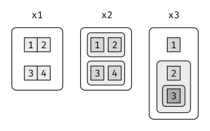

# Vectores

## Introducción

Hasta ahora este libro se ha enfocado en los tibbles y los paquetes que trabajan con ellos. Pero a medida que empieces a escribir tus propias funciones y a profundizar en R, es necesario que aprendas sobre vectores, esto es, sobre los objetos que están a la base de los tibbles. Si aprendiste R de una manera más tradicional, probablemente ya te hayas familiarizado con los vectores, ya que la mayoría de los recursos sobre R parten con vectores y luego abordan los tibbles. Creemos que es mejor empezar con los tibbles porque resultan útiles de inmediato y luego explorar los componentes que están a la base. 
Los vectores son particularmente importantes, ya que la mayoría de las funciones que escribirás trabajan con ellos. Es posible escribir funciones que trabajen con tibbles (como **ggplot2**, **dplyr** y **tidyr**); sin embargo, las herramientas que necesitas para hacerlo aún son idiosincráticas y no están lo suficientemente maduras. Estamos trabajando en una mejor aproximación (https://github.com/hadley/lazyeval), pero no estará lista a tiempo para la publicación del libro. Incluso aún cuando esté completa, será necesaro que entiendas los vectores: hará que sea más fácil escribir una capa amigable con el usuario encima de ellos.

### Prerrequisitos

Este capítulo se enfoca en las estructuras de datos de R base, por lo que no es esencial cargar ningún paquete. Sin embargo, usaremos un conjunto de funciones del paquete **purrr** para evitar algunas inconsistencias de R base.


```r
library(tidyverse)
```

## Vectores básicos

Hay dos tipos de vectores:

1.	Vectores **atómicos**, de los cuales existen seis tipos: **lógico**, **entero**, **doble**, **caracter**, **complejo** y **sin procesar** (_raw_). Los vectores de tipo entero y doble son conocidos de manera colectiva como vectores numéricos.
2.	Las **listas**, que a veces son denominadas como vectores recursivos debido a que pueden contener otras listas.

La diferencia principal entre vectores atómicos y listas es que los vectores atómicos son **homogéneos**, mientras las listas pueden ser **heterogéneas**. Existe otro objeto relacionado: `NULL` (nulo). `NULL` es a menudo utilizado para representar la ausencia de un vector (en oposición a `NA` que se utiliza para representar la ausencia de un valor en un vector). `NULL` se comporta típicamente como un vector de longitud 0 (cero). La figura \@ref(fig:datatypes) resume las interrelaciones.


<div class="figure" style="text-align: center">

<p class="caption">(\#fig:datatypes)La jerarquía de los tipos de vectores en R</p>
</div>

Cada vector tiene dos propiedades clave:

1. Su __tipo__ (_type_), que puedes determinar con `typeof()` (_tipo de_).


```r
 typeof(letters)
#> [1] "character"
 typeof(1:10)
#> [1] "integer"
```

1. Su __longitud__ (_length_), que puede determinar con `length()`.


```r
 x <- list("a", "b", 1:10)
 length(x)
#> [1] 3
```

Los vectores pueden contener también metadata adicional arbitraria en forma de atributos. Estos atributos son usados para crear **vectores aumentados**, los que se basan en un comportamiento distinto. Existen tres tipos de vectores aumentados:
* Los factores (_factors_), construidos sobre la base de vectores de enteros.
* Las fechas y fechas-hora (_date-times_), construidas a partir de vectores numéricos.
* Los dataframes y tibbles, construidos a partir de listas.

Este capítulo te introducirá en estos importantes vectores, desde los más simples a los más complicados. Comenzarás con vectores atómicos, luego seguirás con listas y finalizarás con vectores aumentados.

## Tipos importantes de vectores atómicos

Los cuatro tipos más importantes de vectores atómicos son lógico, entero, doble y carácter. Los de tipo _raw_ y complejo son raramente usados durante el análisis de datos, por lo tanto, no discutiremos sobre ellos aquí.

### Lógico
Los vectores de tipo lógico son el tipo más sencillo de vectores atómicos, ya que solo pueden tomar tres valores posibles: `FALSE`, `TRUE` y `NA`. Los vectores lógicos son construidos usualmente con operadores de comparación, tal como se describe en la sección [comparaciones]. También puedes crearlos manualmente con la función `c()`:


```r
1:10 %% 3 == 0
#>  [1] FALSE FALSE  TRUE FALSE FALSE  TRUE FALSE FALSE  TRUE FALSE

c(TRUE, TRUE, FALSE, NA)
#> [1]  TRUE  TRUE FALSE    NA
```

### Numérico

Los vectores de tipo entero y doble se conocen de manera colectiva como vectores numéricos. En R, los números por defecto son representados como _double_. Para generar un entero, coloca una L después del número:


```r
typeof(1)
#> [1] "double"
typeof(1L)
#> [1] "integer"
1.5L
#> [1] 1.5
```

La distinción entre enteros y dobles usualmente no resulta importante, aunque existen dos diferencias relevantes de las que debes ser consciente:

1. Los números dobles son aproximaciones. Representan números de punto flotante que no siempre pueden ser representados de manera precisa con un cantidad fija de memoria. Esto significa que debes considerar a todos los dobles como aproximaciones. Por ejemplo, ¿cuál es el cuadrado de la raíz cuadrada de dos?


 
 ```r
 x <- sqrt(2) ^ 2
 x
 #> [1] 2
 x - 2
 #> [1] 4.44e-16
 ```

Este comportamiento es común cuando trabajas con números de punto flotante: la mayoría de los cálculos incluyen algunos errores de aproximación. En lugar de comparar números de punto flotante usando `==`, debes usar ´dplyr::near()`, que provee tolerancia numérica.

2. Los números enteros tienen un valor especial, `NA`, mientras que los dobles tienen cuatro tipos: `NA`, `NaN`, `Inf` and `–Inf`. Los tres valores especiales `NaN`, `Inf` and `-Inf` pueden surgir durante una división:


```r
c(-1, 0, 1) / 0
#> [1] -Inf  NaN  Inf
```

Evita usar `==` para chequear estos valores especiales. En su lugar usa la funciones de ayuda `is.finite()`, `is.infinite()`, y `is.nan()`:


 | | 0 | Inf | NA | NaN |
 |------------------|-----|-----|-----|-----|
 | `is.finite()` | x | | | |
 | `is.infinite()` | | x | | |
 | `is.na()` | | | x | x |
 | `is.nan()` | | | | x |

### Caracter

Los vectores de caracteres son los tipos de vectores atómicos más complejos, ya que cada elemento del mismo es un _string_ (una cadena de caracteres) y un _string_ puede contener una cantidad arbitraria de datos.
Ya has aprendido un montón acerca de cómo trabajar con _strings_ en el capítulo sobre [Cadenas de caracteres]. Pero queremos mencionar una característica importante de la implementación que subyace a los _strings_: R usa una reserva global de _strings_. Esto significa que cada string único solo es almacenado en la memoria una vez y cada uso de un _string_ apunta a esa representación. Esto reduce la cantidad de memoria necesaria para _strings_ duplicados. Puedes ver este comportamiento en práctica con `pryr::object_size()`:


```r
x <- "Esta es una cadena de caracteres razonablemente larga."
pryr::object_size(x)
#> Registered S3 method overwritten by 'pryr':
#>   method      from
#>   print.bytes Rcpp
#> 168 B

y <- rep(x, 1000)
pryr::object_size(y)
#> 8.16 kB
```
`y` no utiliza 1000 veces más memoria que `x`, ya que cada elemento de `y` solo apunta al mismo _string_. Cada uno de estos _punteros_ utiliza 8 bytes, por lo que 1000 punteros hacia un _string_ de 168 B es igual a 8 * 1000 + 168 = 8.16 kB.

### Valores faltantes

Cada tipo de vector atómico tiene su propio valor faltante (_missing value_):


```r
NA # lógico
#> [1] NA
NA_integer_ # entero
#> [1] NA
NA_real_ # doble o real
#> [1] NA
NA_character_ # caracter
#> [1] NA
```

Normalmente no necesitas saber sobre los diferentes tipos porque siempre puedes usar `NA` (del inglés _Not Available_, _no disponible_), el que se convertirá al tipo correcto usando las reglas implícitas de coerción. Sin embargo, existen algunas funciones que son estrictas acerca de sus inputs, por lo que es útil tener presente este conocimiento, así tu código puede ser lo suficientemente específico cuando lo necesites.

### Ejercicios

1. Describe la diferencia entre `is.finite(x)` y `!is.infinite(x)`.
1. Lee el código fuente de `dplyr:: near()` (Pista: para ver el código fuente, escribe el nombre de la función sin `()`). ¿Funcionó?
1. Un vector de tipo lógico puede tomar 3 valores posibles. ¿Cuántos valores posibles puede tomar un vector de tipo entero? ¿Cuántos valores posibles puede tomar un vector de tipo doble? Usa google para investigar sobre esto.
1. Idea al menos 4 funciones que te permitan convertir un vector de tipo doble a entero. ¿En qué difieren las funciones? Describe las diferencias con precisión.
1. ¿Qué funciones del paquete **readr** te permiten convertir una cadena de caracteres en un vector de tipo lógico, entero y doble?

## Usando vectores atómicos

Ahora que conoces los diferentes tipos de vectores atómicos, es útil repasar algunas herramientas importantes para trabajar con ellos. Estas incluyen:

1.	Cómo realizar una conversión de un determinado tipo a otro y en qué casos esto sucede automáticamente.
2.	Cómo decidir si un objeto es de un tipo específico de vector.
3.	Qué sucede cuando trabajas con vectores de diferentes longitudes.
4.	Cómo nombrar los elementos de un vector
5.	Cómo extraer los elementos de interés de un vector.

### Coerción

Existen dos maneras de convertir, o coercionar, un tipo de vector a otro:

1. La coerción explícita ocurre cuando llamas una función como `as.logical()`, `as.integer()`, `as.double()`, o `as.character()`. Cuando te encuentres usando coerción expíicita, comprueba si es posible hacer algún tipo de arreglo antes que permita que al vector nunca se le llegue a asignar el tipo incorrecto. Por ejemplo, podrías necesitar ajustar la especificación de `col_types` (_tipos de columna_) del paquete **readr** cuando importas los datos.

1. La coerción implícita ocurre cuando usas un vector en un contexto específico en el que se espera que sea de cierto tipo. Por ejemplo, cuando usas un vector de tipo lógico con la función numérica `summary` (_resumen_), o cuando usas un vector de tipo doble donde se espera que sea de tipo entero.
Debido a que la coerción explícita se usa raramente y es mucho más fácil de entender, nos enfocaremos acá en la coerción implícita.
Ya viste el tipo más importante de coerción implícita: cuando se usa un vector de tipo lógico en un contexto numérico. En ese caso, el valor `TRUE` es convertido a `1` y `FALSE` a `0`. Esto significa que la suma de un vector de tipo lógico es el número de valores verdaderos, y que la media es de un vector lógico es la proporción de valores verdaderos:


```r
x <- sample(20, 100, replace = TRUE)
y <- x > 10
sum(y) # ¿Cuántos valores son más grandes que 10?
#> [1] 38
mean(y) # ¿Qué proporción es mayor que 10?
#> [1] 0.38
```

Quizás veas código (usualmente más antiguo) que se basa en la coerción implícita en la dirección opuesta, es decir, de un valor entero a uno lógico:


```r
if (length(x)) {
 # hacer algo
}
```

En este caso, `0` es convertido a `FALSE` y todo lo demás es convertido a `TRUE`. Creemos que esto hace que tu código sea más difícil de entender, por lo que no lo recomendamos. En su lugar, utiliza explícitamente: `length(x) > 0`.

Es también importante entender qué ocurre cuando creas un vector que contiene múltiples tipos usando `c()`: los tipos más complejos siempre ganan.


```r
typeof(c(TRUE, 1L))
#> [1] "integer"
typeof(c(1L, 1.5))
#> [1] "double"
typeof(c(1.5, "a"))
#> [1] "character"
```

Un vector atómico no puede contener una mezcla de diferentes tipos, ya que el tipo es una propiedad del vector completo, no de los elementos individuales. Si necesitas mezclar diferentes tipos en el mismo vector, entonces deberías utilizar una lista, sobre la que aprenderás en breve.

### Funciones de prueba

Algunas veces quieres diferentes cosas dependiendo del tipo de vector. Una opción es utilizar `typeof()`; otra es usar una función de prueba que devuelva `TRUE` o `FALSE`. Si bien R base provee muchas funciones como `is.vector()` e `is.atomic()`, estas a menudo devuelven resultados inesperados. En su lugar, es más seguro utilizar las funciones `is_*` provistas por el paquete **purrr**, que se resumen en la tabla de más abajo. 

| | lgl | int | dbl | chr | list |
|------------------|-----|-----|-----|-----|------|
| `is_logical()` | x | | | | |
| `is_integer()` | | x | | | |
| `is_double()` | | | x | | |
| `is_numeric()` | | x | x | | |
| `is_character()` | | | | x | |
| `is_atomic()` | x | x | x | x | |
| `is_list()` | | | | | x |
| `is_vector()` | x | x | x | x | x |

Cada predicado además viene con una versión "escalar", como `is_scalar_atomic()`, que chequea que la longitud sea 1. Esto es útil, por ejemplo, si quieres chequear que un argumento de tu función sea un solo valor lógico.

### Escalares y reglas de reciclado

Así como se coercionan implícitamente los tipos de vectores para que sean compatibles, R también implicitamente coerciona la longitud de los vectores. Esto se denomina __reciclado__ de vectores (_vector recicling_), debido a que el vector de menor longitud se repite, o recicla, hasta igualar la longitud del vector más largo.
Generalmente, esto es más útil cuando estás trabajando con vectores y "escalares". Hemos puesto "escalares" entre comillas porque R en realidad no tiene escalares: en su lugar, un solo número es un vector de longitud 1. Debido a que no existen los escalares, la mayoría de las funciones pre-definidas están vectorizadas, lo que implica que operarán en un vector de números. Esa es la razón de por qué, por ejemplo, el siguiente código funciona:


```r
sample(10) + 100 # (sample = muestreo)
#>  [1] 107 104 103 109 102 101 106 110 105 108
runif(10) > 0.5
#>  [1] FALSE  TRUE FALSE FALSE  TRUE  TRUE  TRUE  TRUE  TRUE  TRUE
```
En R, las operaciones matemáticas básicas funcionan con vectores. Esto significa que nunca necesitarás la ejecución de una interacción explícita cuando realices cálculos matemáticos sencillos.
Es intuitivo lo que debería pasar si agregas dos vectores de la misma longitud, o un vector y un "escalar". Pero ¿qué sucede si agregas dos vectores de diferentes longitudes?


```r
1:10 + 1:2
#>  [1]  2  4  4  6  6  8  8 10 10 12
```
Aquí, R expandirá el vector más corto a la misma longitud del vector más largo, que es lo que denominamos _reciclaje_. Esto se realiza de manera silenciosa, excepto cuando la longitud del vector más largo no es un múltiplo entero de la longitud del vector más corto:


```r
1:10 + 1:3
#> Warning in 1:10 + 1:3: longer object length is not a multiple of shorter object
#> length
#>  [1]  2  4  6  5  7  9  8 10 12 11
```
Si bien el vector reciclado puede ser usado para crear código sucinto e ingenioso, también puede ocultar problemas de manera silenciosa. Por esta razón, las funciones vectorizadas en el tidyverse mostrarán errores cuando reciclas cualquier otra cosa que no sea un escalar. Si realmente quieres reutilizar, necesitarás hacerlo de manera explícita con `rep()`:


```r
tibble(x = 1:4, y = 1:2)
#> Error: Tibble columns must have compatible sizes.
#> * Size 4: Existing data.
#> * Size 2: Column `y`.
#> ℹ Only values of size one are recycled.

tibble(x = 1:4, y = rep(1:2, 2))
#> # A tibble: 4 x 2
#>       x     y
#>   <int> <int>
#> 1     1     1
#> 2     2     2
#> 3     3     1
#> 4     4     2

tibble(x = 1:4, y = rep(1:2, each = 2))
#> # A tibble: 4 x 2
#>       x     y
#>   <int> <int>
#> 1     1     1
#> 2     2     1
#> 3     3     2
#> 4     4     2
```
### Nombrar vectores

Todos los tipos de vectores pueden ser nombrados. Puedes asignarles un nombre al momento de crearlos con `c()`:


```r
c(x = 1, y = 2, z = 4)
#> x y z 
#> 1 2 4
```

O después de haberlos creado con `purrr::set_names()`:


```r
set_names(1:3, c("a", "b", "c"))
#> a b c 
#> 1 2 3
```
Los vectores con nombres son particularmente útiles para la creación de subconjuntos, como se describe a continuación.

### Creación de subconjuntos (_subsetting_){#vector-subsetting}

Hasta ahora hemos utilizado `dplyr::filter()` para filtrar filas en un tibble. `filter()` solo funciona con tibbles, por lo que necesitaremos una nueva herramienta para trabajar con vectores: `[`. `[`  es la función para crear subconjuntos (_subsetting_) y podemos llamarla como `x[a]`. Existen cuatro tipos de cosas con las que puedes un crear un _subset_ de un vector:

1. Un vector numérico que contenga solo enteros. Los enteros deben ser todos positivos, todos negativos, o cero.

        Crear subconjuntos con enteros positivos mantiene los elementos en aquellas posiciones:
        

```r
x <- c("uno", "dos", "tres", "cuatro", "cinco")
x[c(3, 2, 5)]
#> [1] "tres"  "dos"   "cinco"
```
        
        Repitiendo una posición, puedes en realidad generar un output de mayor longitud que el input:
        

```r
x[c(1, 1, 5, 5, 5, 2)]
#> [1] "uno"   "uno"   "cinco" "cinco" "cinco" "dos"
```

        Los valores negativos eliminan elementos en las posiciones especificadas:
        

```r
x[c(-1, -3, -5)]
#> [1] "dos"    "cuatro"
```

        Es un error mezclar valores positivos y negativos:
        
        

```r
x[c(1, -1)]
#> Error in x[c(1, -1)]: only 0's may be mixed with negative subscripts
```
        
        El mensaje menciona crear subsets utilizando cero, lo que no retorna valores.
        

```r
x[0]
#> character(0)
```
        
        Esto a menudo no es útil, pero puede ser de ayuda si quieres crear estructuras de datos inusuales con las que testear tus funciones.
        

2. Crear subsets con un vector lógico mantiene todos los valores que  correspondan al valor `TRUE`. Esto es usualmente útil en conjunto con las funciones de comparación.


```r
x <- c(10, 3, NA, 5, 8, 1, NA)
        
# Todos los valores no faltantes de x
x[!is.na(x)]
#> [1] 10  3  5  8  1
        
# Todos los valores pares (o faltantes!) de x
x[x %% 2 == 0]
#> [1] 10 NA  8 NA
```

3. Si tienes un vector con nombre, puedes subdivirlo en un vector de tipo caracter.


```r
x <- c(abc = 1, def = 2, xyz = 5)
x[c("xyz", "def")]
#> xyz def 
#>   5   2
```

        Al igual que con los enteros positivos, también puedes usar un vector del tipo caracter para duplicar entradas individuales.

4. El tipo más sencillo de _subsetting_ es nada, `x[]`, lo que retorna el valor completo de `x`. Esto no es útil para crear subconjuntos de vectores, pero sí lo es para el caso de las matrices (y otras estructuras de alta dimensionalidad), ya que te permite seleccionar toda las filas o todas las columnas, dejando el índice en blanco. Por ejemplo, si `x` tiene dos dimensiones, `x[1, ]` selecciona la primera fila y todas las columnas y `x[, -1]` selecciona todas las filas y todas las columnas excepto la primera.

Para aprender más acerca de las aplicaciones de la creación de subconjuntos, puedes leer el capítulo "Subsetting" de _Advanced R_: <http://adv-r.hadley.nz/Subsetting.html#applications>.

Existe una importante variación de `[` llamada `[[`. `[[` solo extrae un único elemento y siempre descarta nombres. Es una buena idea usarla cada vez que quieras dejar en claro que estás extrayendo un único item, como en un bucle _for_ (_for loop_). La diferencia entre `[` y`[[` es más importante para el caso de las listas, como veremos en breve.

### Ejercicios

1. ¿Qué es lo que `mean(is.na(x))` te dice acerca del vector 'x'? ¿Y qué es lo que te dice `sum(!is.finite(x))`?

1. Lee detenidamente la documentación de `is.vector()`. ¿Qué es lo que esta función realmente testea? ¿Por qué la función `is.atomic()` no concuerda con la definición de vectores atómicos vista anteriormente?

1. Compara y contrasta `setNames()` con `purrr::set_names()`.

1. Crea funciones que tomen un vector como input y devuelvan:
	1. El último valor. ¿Deberías usar `[` o `[[`?
	1. Los elementos en posiciones pares.
	1. Cada elemento excepto el último valor.
	1. Solo las posiciones pares (sin valores perdidos).

1. ¿Por qué `x[-which(x > 0)]` no es lo mismo que `x[x <= 0]`?

1. ¿Qué sucede cuando realizas un subset con un entero positivo que es mayor que la longitud del vector? ¿Qué sucede cuando realizas un subset con un nombre que no existe?

## Vectores Recursivos (listas)

Las listas son un escalón más en complejidad respecto de los vectores atómicos, ya que pueden contener otras listas en su interior. Esto las hace adecuadas para representar estructuras jerárquicas o de tipo árbol. Puedes crear una lista con ´list()´:


```r
x <- list(1, 2, 3) 
x
#> [[1]]
#> [1] 1
#> 
#> [[2]]
#> [1] 2
#> 
#> [[3]]
#> [1] 3
```
Un herramienta muy útil para trabajar con listas es `str()` ya que se enfoca en la e**str**uctura, no en los contenidos.

```r
str(x)
#> List of 3
#>  $ : num 1
#>  $ : num 2
#>  $ : num 3

x_nombrada <- list(a = 1, b = 2, c = 3)
str(x_nombrada)
#> List of 3
#>  $ a: num 1
#>  $ b: num 2
#>  $ c: num 3
```

A diferencia de los vectores atómicos, ´list()´ puede contener una mezcla de objetos:

```r
y <- list("a", 1L, 1.5, TRUE)
str(y)
#> List of 4
#>  $ : chr "a"
#>  $ : int 1
#>  $ : num 1.5
#>  $ : logi TRUE
```

¡Las listas incluso pueden contener otras listas!

```r
z <- list(list(1, 2), list(3, 4))
str(z)
#> List of 2
#>  $ :List of 2
#>   ..$ : num 1
#>   ..$ : num 2
#>  $ :List of 2
#>   ..$ : num 3
#>   ..$ : num 4
```

### Visualizando listas

Para explicar funciones de manipulación de listas más complejas, es útil tener una representacion visual de las listas. Por ejemplo, considera estas tres listas:

```r
x1 <- list(c(1, 2), c(3, 4))
x2 <- list(list(1, 2), list(3, 4))
x3 <- list(1, list(2, list(3)))
```

Así es como las representaremos visualmente:


Existen tres principios en la imagen anterior:

1.	Las listas tienen esquinas redondeadas; los vectores atómicos esquinas cuadradas.
2.	Los elementos hijos están dibujados dentro de sus padres y tienen un fondo ligeramente más oscuro para facilitar la visualización de la jerarquía.
3.	No es importante la orientación de los elementos hijos (esto es, las filas o columnas), por lo que si elegimos determinada orientación será para ahorrar espacio o para ilustrar una propiedad importante en el ejemplo.

### Subconjuntos (_Subsetting_)
Existen tres maneras de extraer subconjuntos de una lista, los que ilustraremos con una lista denominada `a`:

```r
a <- list(a = 1:3, b = "una cadena", c = pi, d = list(-1, -5))
```

* El corchete simple `[` extrae una sub-lista. El resultado siempre será una lista.
        

```r
str(a[1:2])
#> List of 2
#>  $ a: int [1:3] 1 2 3
#>  $ b: chr "una cadena"
str(a[4])
#> List of 1
#>  $ d:List of 2
#>   ..$ : num -1
#>   ..$ : num -5
```
        
        Al igual que con los vectores, puedes extraer subconjuntos con un vector lógico, de enteros o de caracteres.

* El doble corchete `[[` extrae un solo componente de una lista. Elimina un nivel de la jerarquía de la lista.
        

```r
str(a[[1]])
#>  int [1:3] 1 2 3
str(a[[4]])
#> List of 2
#>  $ : num -1
#>  $ : num -5
```

* `$` es un atajo para extraer elementos con nombre de una lista. Funciona de modo similar al doble corchete `[[`, excepto que no necesitas utilizar comillas.
        

```r
a$a
#> [1] 1 2 3
a[["a"]]
#> [1] 1 2 3
```

La diferencia entre `[` y `[[` es muy importante para las listas, ya que `[[` se adentra en una lista mientras que `[` retorna una lista nueva, más pequeña. Compara el código y el output de arriba con la representación visual de la Figura \@ref(fig:lists-subsetting).

<div class="figure" style="text-align: center">

<p class="caption">(\#fig:lists-subsetting)Subdividir una lista, de manera visual.</p>
</div>

### Listas de Condimentos
La diferencia entre `[` y `[[` es muy importante, pero es muy fácil confundirse. Para ayudarte a recordar, te mostraremos un pimentero inusual.


Si este pimientero es tu lista `x`, entonces, `x[1]` es un pimientero que contiene un solo paquete de pimienta:


`x[2]` luciría igual, pero contendría el segundo paquete. `x[1:2]` sería un pimentero que contiene dos paquetes de pimienta.

`x[[1]]` es:

Si quisieras obtener el contenido del paquete de pimienta, necesitarías utilizar `x[[1]][[1]`:


### Ejercicios
1.Dibuja las siguientes listas como sets anidados:

        1. `list(a, b, list(c, d), list(e, f))`
        1. `list(list(list(list(list(list(a))))))`

2.¿Qué pasaría si hicieras _subsetting_ a un tibble como si fuera una lista? ¿Cuáles son las principales diferencias entre una lista y un tibble?

## Atributos

Cualquier vector puede contener metadatos arbitrarios adicionales mediante sus **atributos**. Puedes pensar en los atributos como una lista de vectores con nombre que pueden ser adjuntadas a cualquier otro objeto. Puedes obtener y definir valores de atributos individuales con `attr()` o verlos todos al mismo tiempo con `attributes()`.


```r
x <- 1:10
attr(x, "saludo")
#> NULL
attr(x, "saludo") <- "¡Hola!"
attr(x, " despedida") <- "¡Adiós!"
attributes(x)
#> $saludo
#> [1] "¡Hola!"
#> 
#> $` despedida`
#> [1] "¡Adiós!"
```

Existen tres atributos muy importantes que son utilizados para implementar partes fundamentals de R:

1.	Los __nombres__ son utilizados para nombrar los elementos de un vector.

2.	Las __dimensiones__ (o dims, abreviado) hacen que un vector se comporte como una matriz o _array_.

3.	La __clase__ es utilizada para implementar el sistema orientado a objetos S3.

Ya revisamos los nombres más arriba y no abordaremos las dimensiones porque en este libro no utilizamos matrices. Nos queda describir el atributo _clase_, que controla cómo trabajan las **funciones genéricas**. Las funciones genéricas son clave para la programación orientada a objetos en R, ya que hacen que las funciones se comporten de manera diferente para diferentes clases de inputs. Está fuera del alcance de este libro tener una discusión más profunda sobre la programacion orientada a objetos, pero puedes leer más al respecto en el libro _Advanced R_: <https://adv-r.hadley.nz/s3.html>.

Así es como luce una función genérica típica:


```r
as.Date
#> function (x, ...) 
#> UseMethod("as.Date")
#> <bytecode: 0x19ad2d8>
#> <environment: namespace:base>
```

La llamada a "UseMethod" significa que esta es una función genérica y que llamará a un **método** específico, esto es, una función basada en la clase del primer argumento. (Todos los métodos son funciones; no todas las funciones son métodos). Puedes listar todos los métodos existentes para una función genérica con `methods()`:


```r
methods("as.Date")
#> [1] as.Date.character   as.Date.default     as.Date.factor     
#> [4] as.Date.numeric     as.Date.POSIXct     as.Date.POSIXlt    
#> [7] as.Date.vctrs_sclr* as.Date.vctrs_vctr*
#> see '?methods' for accessing help and source code
```

Por ejemplo, si `x` es un vector de caracteres, `as.Date()` llamará a `as.Date.character()`; si es un factor, llamará a `as.Date.factor()`.

Puedes ver la implementación específica de un método con: `getS3method()`:


```r
getS3method("as.Date", "default")
#> function (x, ...) 
#> {
#>     if (inherits(x, "Date")) 
#>         x
#>     else if (is.logical(x) && all(is.na(x))) 
#>         .Date(as.numeric(x))
#>     else stop(gettextf("do not know how to convert '%s' to class %s", 
#>         deparse1(substitute(x)), dQuote("Date")), domain = NA)
#> }
#> <bytecode: 0x15397f0>
#> <environment: namespace:base>
getS3method("as.Date", "numeric")
#> function (x, origin, ...) 
#> {
#>     if (missing(origin)) 
#>         stop("'origin' must be supplied")
#>     as.Date(origin, ...) + x
#> }
#> <bytecode: 0xa640fe0>
#> <environment: namespace:base>
```
La S3 genérica más importante es `print()`: controla cómo el objeto es impreso cuando tipeas su nombre en la consola. Otras funciones genéricas importantes son las funciones de subconjuntos `[`, `[[` y `$`.

## Vectores aumentados

Los vectores atómicos y las listas son los bloques sobre los que se construyen otros tipos importantes de vectores, como factores y fechas. A estos vectores le llamamos __vectores aumentados__, ya que son vectores con __atributos__ adicionales, incluyendo la clase. Debido a que los vectores aumentados tienen una clase, se comportan de manera diferente a los vectores atómicos sobre los que están construidos. En este libro, hacemos uso de cuatro importantes vectores aumentados:

* Factores
* Fechas
* Fechas-hora
* Tibbles

A continuación encontrarás una descripción de cada uno de ellos.

### Factores

Los factores están diseñados para representar datos categóricos que pueden tomar un set fijo de valores posibles. Están construidos sobre la base de enteros y tienen un atributo de _niveles_ (_levels_):


```r
x <- factor(c("ab", "cd", "ab"), levels = c("ab", "cd", "ef"))
typeof(x)
#> [1] "integer"
attributes(x)
#> $levels
#> [1] "ab" "cd" "ef"
#> 
#> $class
#> [1] "factor"
```

### Fechas y fechas-hora

Las fechas en R son vectores numéricos que representan el número de días desde el 1° de enero de 1970.


```r
x <- as.Date("1971-01-01")
unclass(x)
#> [1] 365

typeof(x)
#> [1] "double"
attributes(x)
#> $class
#> [1] "Date"
```
Los vectores fecha-hora son vectores numéricos de clase `POSIXct`, que representan el número de segundos desde el 1° de enero de 1970. (En caso de que te lo preguntes, "POSIXct" es el acrónimo de _"Portable Operating System Interface" calendar time_, es decir, tiempo calendario de la interfaz portable del sistema operativo")

```r

x <- lubridate::ymd_hm("1970-01-01 01:00")
unclass(x)
#> [1] 3600
#> attr(,"tzone")
#> [1] "UTC"

typeof(x)
#> [1] "double"
attributes(x)
#> $class
#> [1] "POSIXct" "POSIXt" 
#> 
#> $tzone
#> [1] "UTC"
```
El atributo `tzone` es opcional. Controla cómo se imprime la hora, no a qué tiempo absoluto hace referencia.


```r
attr(x, "tzone") <- "US/Pacific"
x
#> [1] "1969-12-31 17:00:00 PST"
attr(x, "tzone") <- "US/Eastern"
x
#> [1] "1969-12-31 20:00:00 EST"
```
Existe otro tipo de fechas-hora llamado POSIXlt. Estos se construyen sobre la base de listas nombradas (_named lists_).

```r
y <- as.POSIXlt(x)
typeof(y)
#> [1] "list"
attributes(y)
#> $names
#>  [1] "sec"    "min"    "hour"   "mday"   "mon"    "year"   "wday"   "yday"  
#>  [9] "isdst"  "zone"   "gmtoff"
#> 
#> $class
#> [1] "POSIXlt" "POSIXt" 
#> 
#> $tzone
#> [1] "US/Eastern" "EST"        "EDT"
```

Los POSIXlts son pocos comunes dentro del tidyverse. Sí lo son en R base, ya que son necesarios para extraer components específicos de una fecha, como el año o el mes. Debido a que el paquete **lubridate** provee funciones de ayuda para efectuar dicha extracción, ya no los necesitarás. Siempre es más sencillo trabajar con POSIXct, por lo que si te encuentras con un POSIXlt, deberías convertirlo a un vector de fecha-hora con `lubridate::as_date_time()`.

### Tibbles
Los tibbles son listas aumentadas: tienen las clases "tbl_df", "tbl" y "data.frame", y atributos `names` (para columna) y `row.names` (para fila):

```r
tb <- tibble::tibble(x = 1:5, y = 5:1)
typeof(tb)
#> [1] "list"
attributes(tb)
#> $names
#> [1] "x" "y"
#> 
#> $row.names
#> [1] 1 2 3 4 5
#> 
#> $class
#> [1] "tbl_df"     "tbl"        "data.frame"
```
La diferencia entre un tibble y una lista, consiste en que todos los elementos de un data frame deben ser vectores de la misma longitud. Todas las funciones que utilizan tibbles imponen esta condición.

Los data.frames tradicionales tienen una estructura muy similar a los tibbles:

```r
df <- data.frame(x = 1:5, y = 5:1)
typeof(df)
#> [1] "list"
attributes(df)
#> $names
#> [1] "x" "y"
#> 
#> $class
#> [1] "data.frame"
#> 
#> $row.names
#> [1] 1 2 3 4 5
```
La diferencia principal entre ambos es la clase. La clase tibble incluye "data.frame", lo que significa que los tibbles heredan el comportamiento regular de un data frame por defecto.

### Ejercicios:

1.	¿Qué valor retorna `hms::hms(3600)`? ¿Cómo se imprime? ¿Cuál es la tipo primario sobre en el que se basa el vector aumentado? ¿Qué atributos utiliza?

2.	Intenta crear un tibble que tenga columnas con diferentes longitudes. ¿Qué es lo que ocurre?

3.	Teniendo en cuenta la definición anterior, ¿está bien tener una lista como columna en un tibble?
